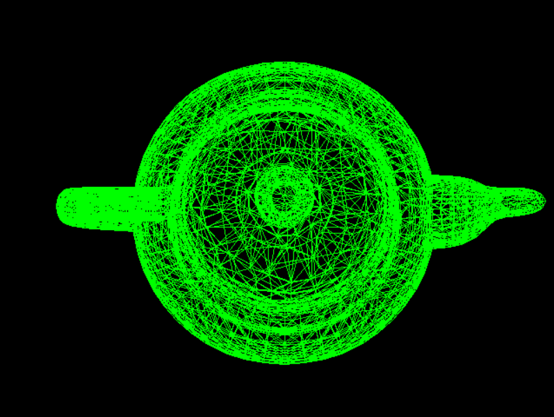

# 中山大学2024《计算机图形学》课程作业

 

授课：陶钧老师

## 目前上线实验

- hw1: 环境配置 + 平面/立体姓名首字母绘制 
  
  
- hw2: 光栅化 + 光照/着色 
  

    
    
    
  

 

- hw3: Phong shading 与 VBO 绘制三维物体
      

- Final Project: 3D烟花粒⼦实时渲染系统 
  
  For More details, see https://github.com/Master7Sword/CG-FinalProject
   
