# 环境配置

### 1.配置IDE
配置环境教程中给的是Visual Studio 2019，我自己一直用的VS 2022，不影响后续配置。

### 2.配置Qt
按照教程，打开Qt官方网址 [https://download.qt.io/official_releases/qt/]

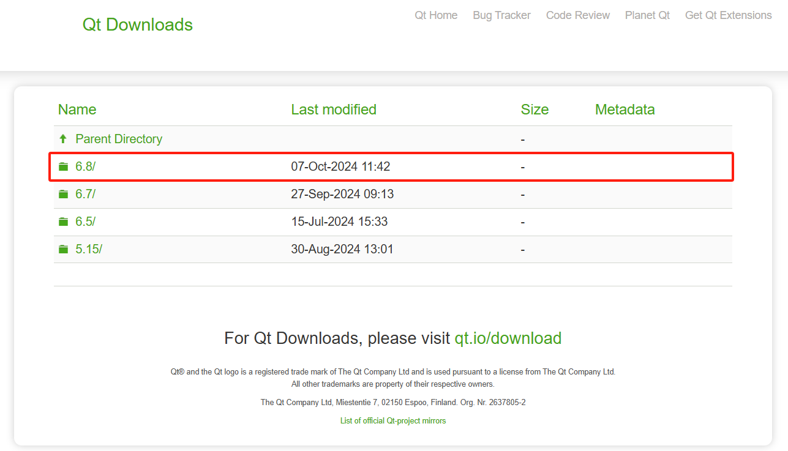

发现只有6.8, 6.7, 6.5以及5.15版本可用，并且未在6.8.0文件夹中找到可下载的exe文件。

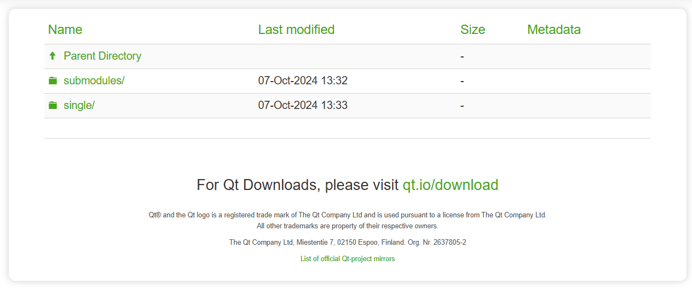

根据QT5.15.0版本官方给出的OFFLINE_README.txt 文件 [https://download.qt.io/official_releases/qt/5.15/5.15.0/OFFLINE_README.txt]：由于Qt Company提供的更改，自Qt 5.15起不再提供开源脱机安装程序。
说白了就是从QT5.15.0版本开始，官方不再提供离线版安装包，除非充钱买商业版。<br>

那没办法，只好用点特殊的手段。从CSDN上找到了百度网盘的链接：
https://pan.baidu.com/s/1pKVpfPOsDWXxGh-IhkG2xA?pwd=4u97
提取码: 4u97

下载并解压得到【qt-unified-windows-x64-online.exe】
双击打开，进入Qt安装程序，用邮箱注册一个Qt账户并登录
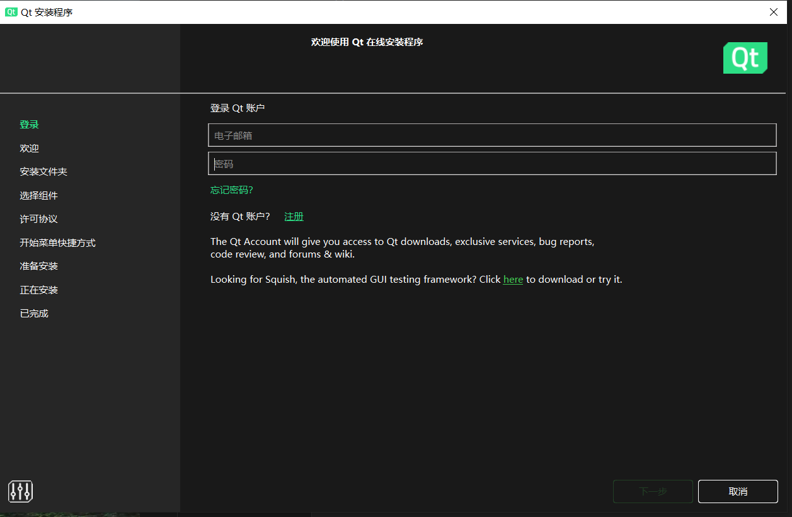

指定Qt安装的目录，并选择"Qt6.8 for desktop development"，注意目录里不能有中文

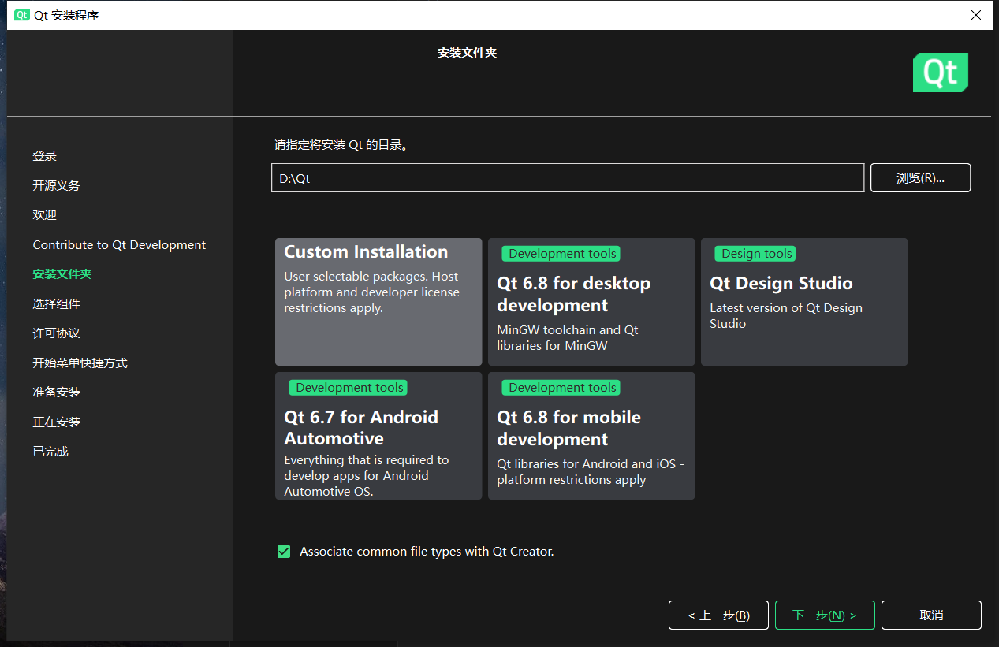

然后选择组件，我安装的是Qt6.8.0，已选择的组件如下
（组件似乎选择MSVC 2022 64-bit就够了)

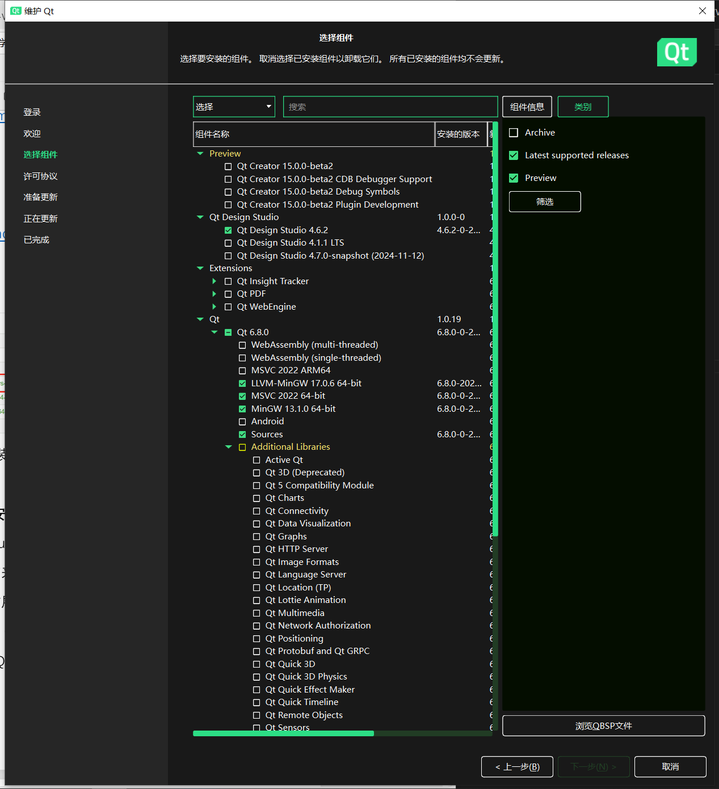

校园网环境下大概下载了1h。至此，Qt安装完成。

### 3.配置Qt VS Tools
按照实验教程，启动VS 2022，选择“继续但无需代码”，菜单栏点击“扩展->管理扩展”，先点“联机”，再在输入框搜索Qt。但是没有搜索到Qt Visual Studio Tools，只搜到了下面的LEGACY Qt Visual Studio Tools，不管翻没翻墙都是一样的结果。


下载完感觉有点不对劲，并且后续配置时出现错误卡住了，所以我又退回来重新装了一遍。Qt Visual Studio Tools下载链接：[https://pan.baidu.com/s/1HXf3ju75VSuR2yQBmCpxhw?pwd=ah31]
下载后双击安装，注意安装时VS一定要关闭，安装好后再打开，可以发现VS的拓展中已经有Qt插件了

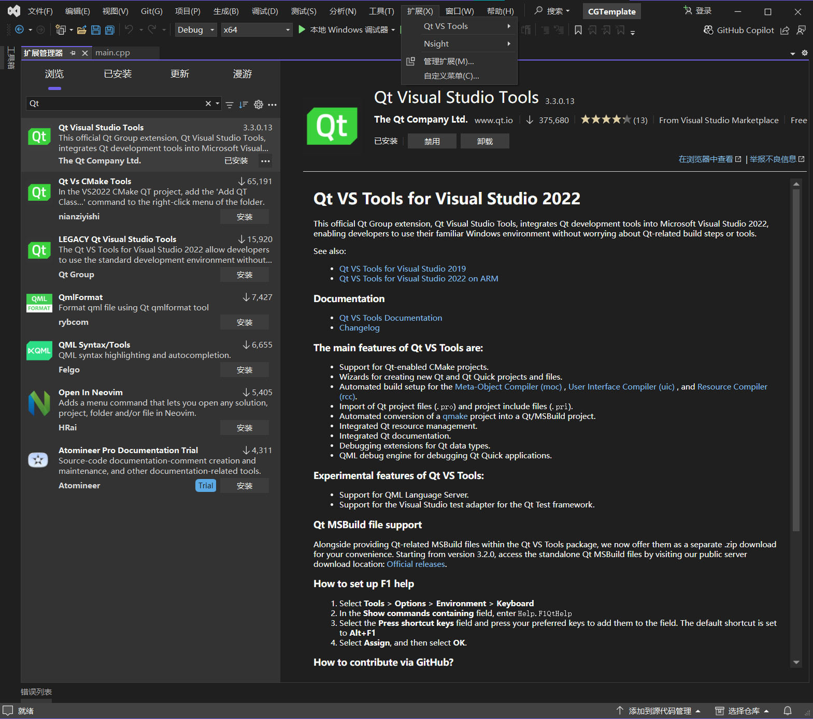

#### 3.1配置Qt插件

启动VS进入主界面，进入扩展中的Qt VS Tools点开Options。 

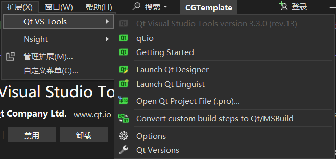

点击Versions进入以下界面，点击Add，浏览到Qt编辑器的安装路径，我的是D:/Qt/6.8.0/msvc2022_64。

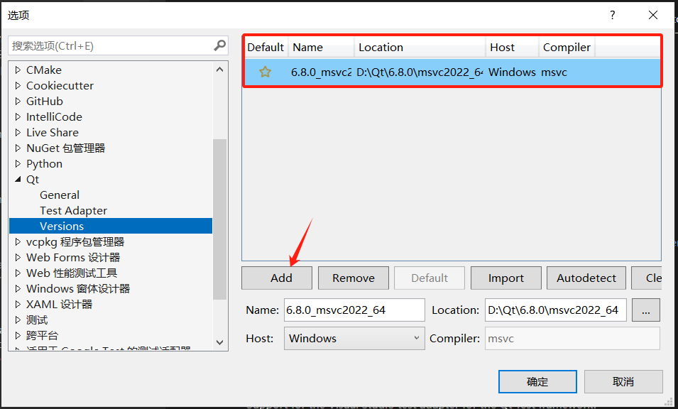

似乎会自动设为默认的编辑器。至此，Qt VS Tools配置完成。

### 4.qmake配置运行环境

首先将安装好的Qt加入系统环境变量，我的是 D:/Qt/6.8.0/msvc2022_64/bin

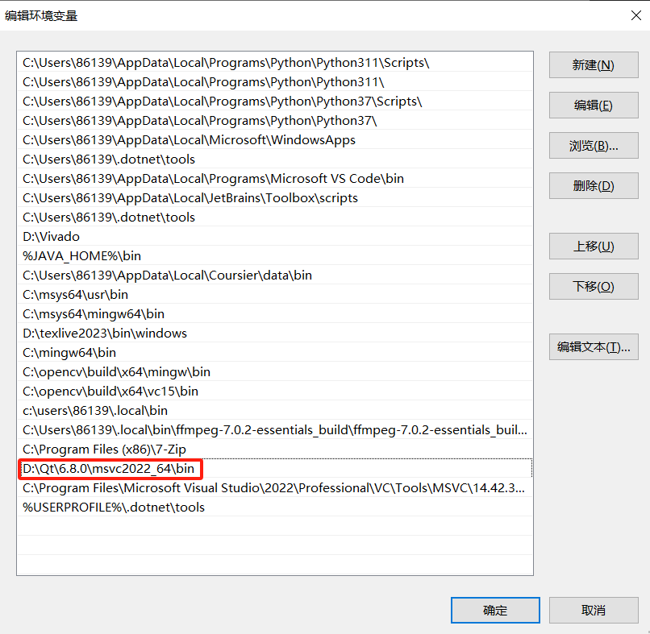

用终端cd到Demo文件夹，执行命令 qmake -tp vc 生成VS工程文件，会报错：

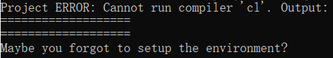

需要将cl.exe的路径加入系统环境变量：

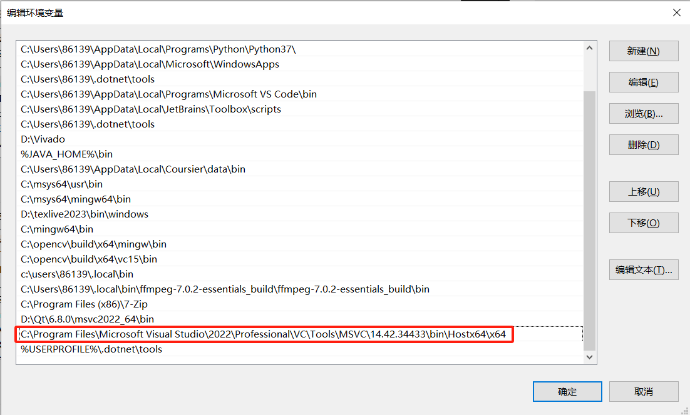

完成后重新打开终端，再次执行命令 qmake -tp vc，此时Demo文件夹中会生成 CGTemplate.vcxproj 等文件

### 5.Demo运行

如图，用VS打开CGTemplate.vcxproj


myglwidget.h中的GL/glew.h是缺失的，需要手动配置。GLEW下载链接：[http://glew.sourceforge.net/]，我选择的是glew.2.1.0。下载后解压并记录路径

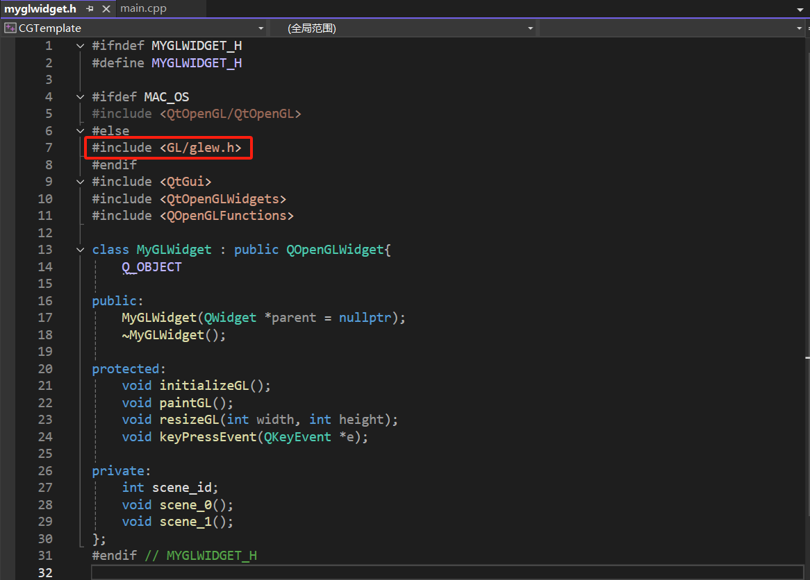

接着配置OpenGL:打开CGTemplate.pro，加入 INCLUDEPATH += "path/to/your/glew-2.1.0/include"，注意双引号内的路径为上一步解压后记录的路径。

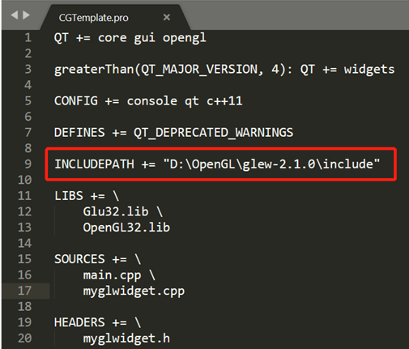

然后重新qmake -tp vc生成项目，运行main.cpp文件，接下来可能会出现两个错误：
#### 1.widget相关的错误

找不到 QOpenGLWidget 引用，而QtGui和QOpenGLFunctions可以被找到

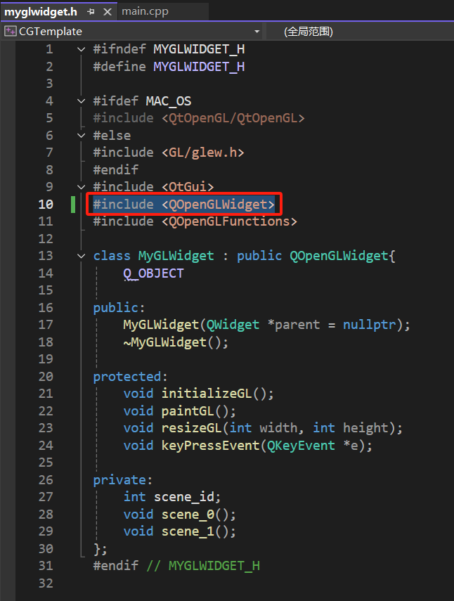

QOpenGLWidget 是 Qt 框架中的一个类，用于在 Qt 应用程序中集成 OpenGL 绘图。它是 Qt 的模块之一，具体来说属于 Qt OpenGL 模块。找不到 QOpenGLWidget 说明Qt OpenGL模块导入时出现了问题，有些库没有导入。怀疑是库版本和实验教程的对不上，因为实验教程演示的Qt版本为5.13.0，而我们安装的是Qt6.8.0。

在VS解决方案中的外部依赖项搜寻，果然只能找到QtGui和QOpenGLFunctions文件，而找不到与Widget有关的文件，从而确定与Widget有关的库没有成功导入。

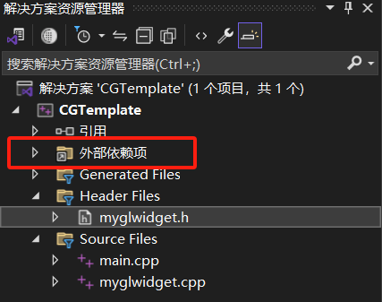

另一边可以观察到，在用于qmake构建VS项目的CGTemplate.pro文件中，有这么两行
```
QT += core gui opengl
greaterThan(QT_MAJOR_VERSION, 4): QT += widgets
```
在 D:/Qt/6.8.0/msvc2022_64/include 目录下面可以找到QtGui和QtOpenGLWidgets文件夹。进一步可以发现QtOpenGLWidgets文件夹下包含qopenglwidget.h头文件，而qopenglwidget.h中正好包含QOpenGLWidget类，这恰好是我们myglwidget.h中的MyGLWidget类所继承的父类。

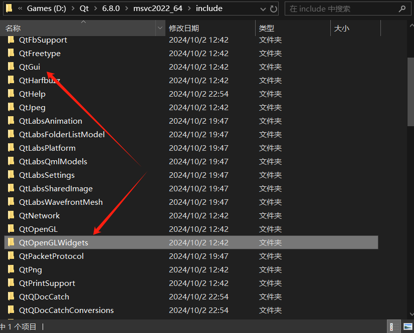
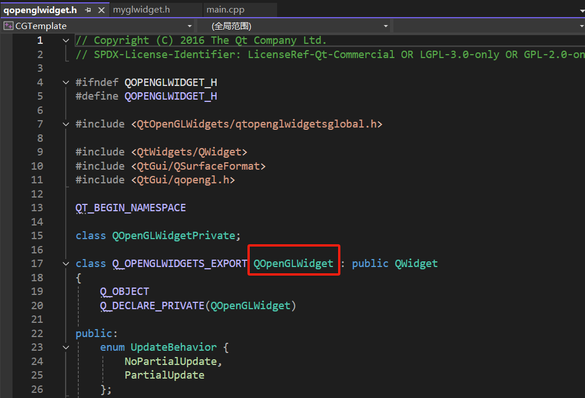
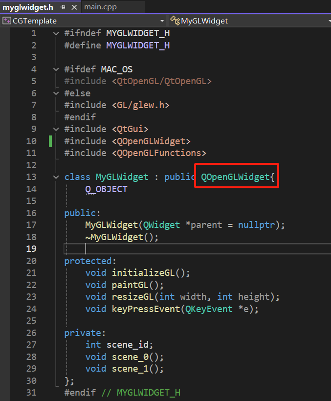

猜想此处只识别到了QtGui文件夹而没有识别到QtOpenGLWidgets文件夹，观察规律，将上述CGTemplate.pro中的两行改为：
```
QT += core gui opengl openglwidgets
```
修改后再次运行main.cpp，和widget有关的错误就解决了。

#### 2.glew32.lib找不到

解决方案资源管理器→CGTemplate→属性→配置属性→链接器→常规→附加库目录

添加包含glew32.lib的文件夹的路径，参考前文glew安装的路径，形如"xxx/xxx/glew-2.1.0/lib/Release/x64"

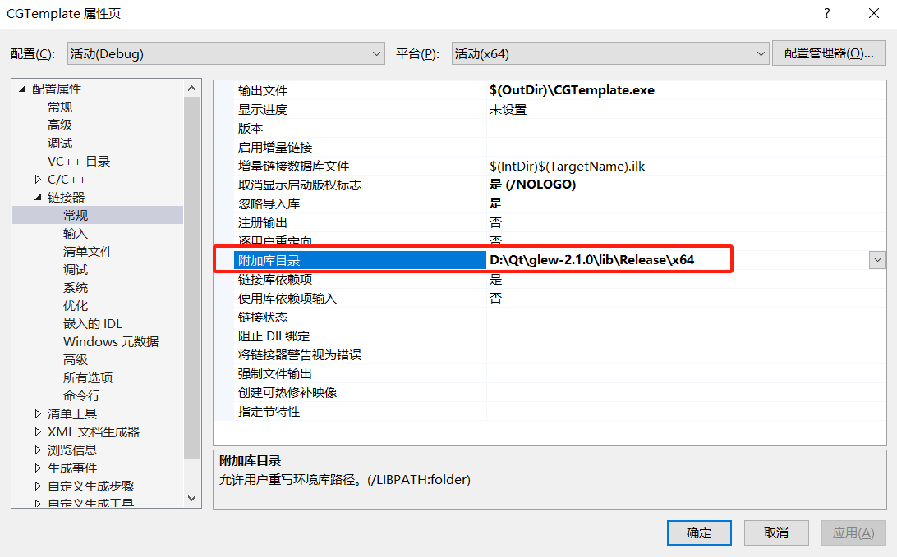

全部配置完成后，成功运行main.cpp

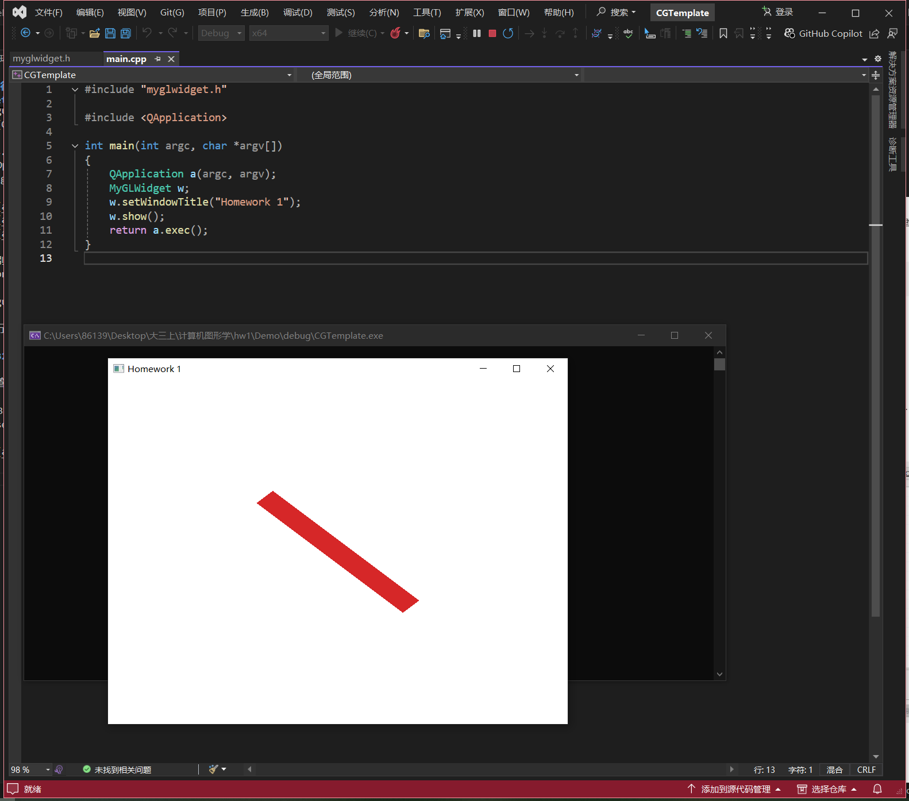