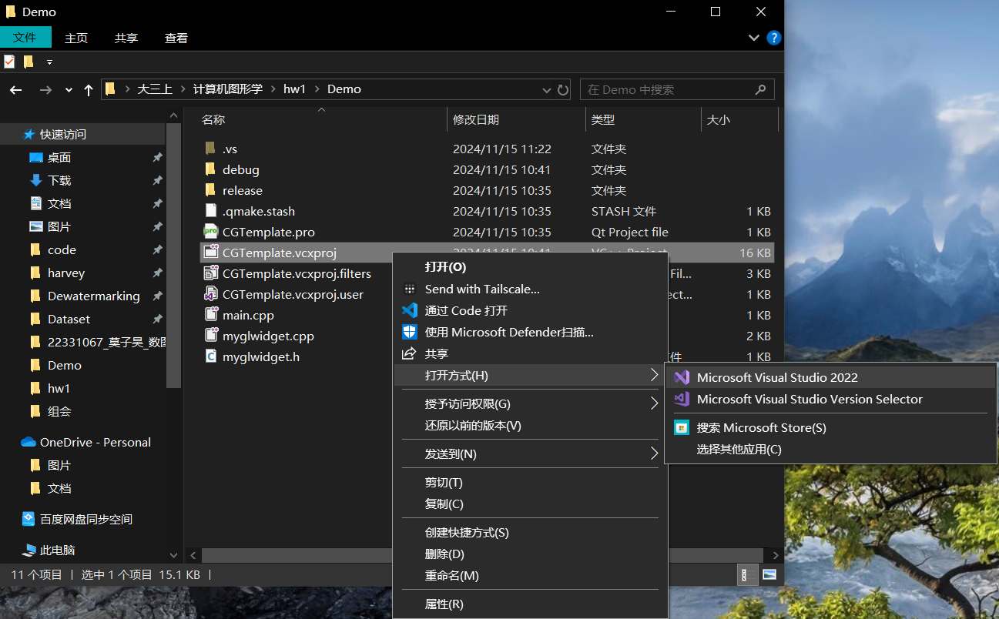
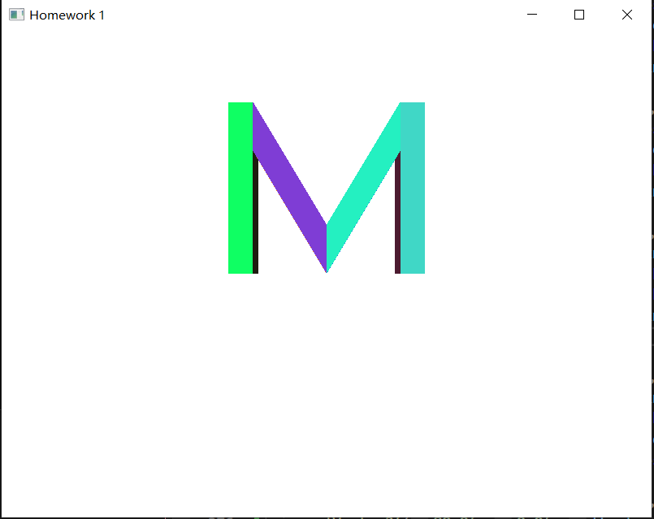

# 环境配置

### 1.配置IDE
配置环境教程中给的是Visual Studio 2019，我自己一直用的VS 2022，不影响后续配置。

### 2.配置Qt
按照教程，打开Qt官方网址 [https://download.qt.io/official_releases/qt/]


发现只有6.8, 6.7, 6.5以及5.15版本可用，并且未在6.8.0文件夹中找到可下载的exe文件。


根据QT5.15.0版本官方给出的OFFLINE_README.txt 文件 [https://download.qt.io/official_releases/qt/5.15/5.15.0/OFFLINE_README.txt]
：由于Qt Company提供的更改，自Qt 5.15起不再提供开源脱机安装程序。
说白了就是从QT5.15.0版本开始，官方不再提供离线版安装包，除非充钱买商业版。<br>

那没办法，只好用点特殊的手段。从CSDN上找到了百度网盘的链接：
https://pan.baidu.com/s/1pKVpfPOsDWXxGh-IhkG2xA?pwd=4u97
提取码: 4u97

下载并解压得到【qt-unified-windows-x64-online.exe】
双击打开，进入Qt安装程序，用邮箱注册一个Qt账户并登录


指定Qt安装的目录，并选择"Qt6.8 for desktop development"，注意目录里不能有中文


然后选择组件，我安装的是Qt6.8.0，已选择的组件如下
（组件似乎选择MSVC 2022 64-bit就够了)


校园网环境下大概下载了1h。至此，Qt安装完成。

### 3.配置Qt VS Tools
按照实验教程，启动VS 2022，选择“继续但无需代码”，菜单栏点击“扩展->管理扩展”，先点“联机”，再在输入框搜索Qt。但是没有搜索到Qt Visual Studio Tools，只搜到了下面的LEGACY Qt Visual Studio Tools，不管翻没翻墙都是一样的结果。


下载完感觉有点不对劲，并且后续配置时出现错误卡住了，所以我又退回来重新装了一遍。Qt Visual Studio Tools下载链接：[https://pan.baidu.com/s/1HXf3ju75VSuR2yQBmCpxhw?pwd=ah31]
下载后双击安装，注意安装时VS一定要关闭，安装好后再打开，可以发现VS的拓展中已经有Qt插件了


#### 3.1配置Qt插件

启动VS进入主界面，进入扩展中的Qt VS Tools点开Options。 


点击Versions进入以下界面，点击Add，浏览到Qt编辑器的安装路径，我的是D:/Qt/6.8.0/msvc2022_64。


似乎会自动设为默认的编辑器。至此，Qt VS Tools配置完成。

### 4.qmake配置运行环境

首先将安装好的Qt加入系统环境变量，我的是 D:/Qt/6.8.0/msvc2022_64/bin


用终端cd到Demo文件夹，执行命令 qmake -tp vc 生成VS工程文件，会报错：


需要将cl.exe的路径加入系统环境变量：


完成后重新打开终端，再次执行命令 qmake -tp vc，此时Demo文件夹中会生成 CGTemplate.vcxproj 等文件

### 5.Demo运行

如图，用VS打开CGTemplate.vcxproj



myglwidget.h中的GL/glew.h是缺失的，需要手动配置。GLEW下载链接：[http://glew.sourceforge.net/]
，我选择的是glew.2.1.0。下载后解压并记录路径


接着配置OpenGL:打开CGTemplate.pro，加入 INCLUDEPATH += "path/to/your/glew-2.1.0/include"，注意双引号内的路径为上一步解压后记录的路径。


然后重新qmake -tp vc生成项目，运行main.cpp文件，接下来可能会出现两个错误：
#### 1.widget相关的错误

找不到 QOpenGLWidget 引用，而QtGui和QOpenGLFunctions可以被找到


QOpenGLWidget 是 Qt 框架中的一个类，用于在 Qt 应用程序中集成 OpenGL 绘图。它是 Qt 的模块之一，具体来说属于 Qt OpenGL 模块。找不到 QOpenGLWidget 说明Qt OpenGL模块导入时出现了问题，有些库没有导入。怀疑是库版本和实验教程的对不上，因为实验教程演示的Qt版本为5.13.0，而我们安装的是Qt6.8.0。

在VS解决方案中的外部依赖项搜寻，果然只能找到QtGui和QOpenGLFunctions文件，而找不到与Widget有关的文件，从而确定与Widget有关的库没有成功导入。


另一边可以观察到，在用于qmake构建VS项目的CGTemplate.pro文件中，有这么两行
```
QT += core gui opengl
greaterThan(QT_MAJOR_VERSION, 4): QT += widgets
```
在 D:/Qt/6.8.0/msvc2022_64/include 目录下面可以找到QtGui和QtOpenGLWidgets文件夹。进一步可以发现QtOpenGLWidgets文件夹下包含qopenglwidget.h头文件，而qopenglwidget.h中正好包含QOpenGLWidget类，这恰好是我们myglwidget.h中的MyGLWidget类所继承的父类。


猜想此处只识别到了QtGui文件夹而没有识别到QtOpenGLWidgets文件夹，观察规律，将上述CGTemplate.pro中的两行改为：
```
QT += core gui opengl openglwidgets
```
修改后再次运行main.cpp，和widget有关的错误就解决了。

#### 2.glew32.lib找不到

解决方案资源管理器→CGTemplate→属性→配置属性→链接器→常规→附加库目录

添加包含glew32.lib的文件夹的路径，参考前文glew安装的路径，形如"xxx/xxx/glew-2.1.0/lib/Release/x64"


全部配置完成后，成功运行main.cpp


# 实验一：绘制平面姓名首字母

基本要求：
在二维画布（XOY平面）上，使用基本图元，以原点为绘制中心，绘制自己姓名首字母（MZH)

## 绘制结果


## 讨论内容

### 1 比较绘制开销

#### 1.1 GL_TRIANGLES

glVertex 调用次数：60（共8+6+6=20个三角形，60个顶点）

```
void MyGLWidget::scene_1()
{
	glClear(GL_COLOR_BUFFER_BIT);
	glMatrixMode(GL_PROJECTION);
	glLoadIdentity();
	glOrtho(0.0f, width(), 0.0f, height(), -1000.0f, 1000.0f);

	glMatrixMode(GL_MODELVIEW);
	glLoadIdentity();
	glTranslatef(0.5 * width(), 0.5 * height(), 0.0f);

    //your implementation here, maybe you should write several glBegin
	glPushMatrix();

	// 绘制字母 M
	glColor3f(0.847f, 0.219f, 0.227f);
	glTranslatef(-200.0f, -50.0f, 0.0f); 
	glBegin(GL_TRIANGLES);
		// 左竖
		glVertex2f(-80.0f, 0.0f); glVertex2f(-80.0f, 140.0f); glVertex2f(-60.0f, 0.0f);
		glVertex2f(-60.0f, 140.0f); glVertex2f(-80.0f, 140.0f); glVertex2f(-60.0f, -0.0f);

		// 左撇
		glVertex2f(-60.0f, 140.0f); glVertex2f(-60.0f, 100.0f); glVertex2f(0.0f, 40.0f);
		glVertex2f(0.0f, 0.0f); glVertex2f(-60.0f, 100.0f); glVertex2f(0.0f, 40.0f);

		// 右撇
		glVertex2f(60.0f, 140.0f); glVertex2f(60.0f, 100.0f); glVertex2f(0.0f, 40.0f);
		glVertex2f(0.0f, 0.0f); glVertex2f(60.0f, 100.0f); glVertex2f(0.0f, 40.0f);

		// 右竖
		glVertex2f(80.0f, 0.0f); glVertex2f(80.0f, 140.0f); glVertex2f(60.0f, 0.0f);
		glVertex2f(60.0f, 140.0f); glVertex2f(80.0f, 140.0f); glVertex2f(60.0f, -0.0f);
	glEnd();
	glPopMatrix();

	// 绘制字母 Z
	glColor3f(0.953f, 0.823f, 0.4f);
	glPushMatrix();
	glTranslatef(0.0f, -50.0f, 0.0f);
	glBegin(GL_TRIANGLES);
		// 顶部横线
		glVertex2f(-80.0f, 140.0f); glVertex2f(80.0f, 140.0f); glVertex2f(-80.0f, 120.0f);
		glVertex2f(80.0f, 140.0f); glVertex2f(80.0f, 120.0f); glVertex2f(-80.0f, 120.0f);

		// 对角线
		glVertex2f(-80.0f, 20.0f); glVertex2f(40.0f, 120.0f); glVertex2f(80.0f, 120.0f);
		glVertex2f(-80.0f, 20.0f); glVertex2f(-40.0f, 20.0f); glVertex2f(80.0f, 120.0f);

		// 底部横线
		glVertex2f(-80.0f, 0.0f); glVertex2f(80.0f, 0.0f); glVertex2f(-80.0f, 20.0f);
		glVertex2f(80.0f, 0.0f); glVertex2f(80.0f, 20.0f); glVertex2f(-80.0f, 20.0f);
	glEnd();
	glPopMatrix();


	// 绘制字母 H
	glColor3f(0.588f, 0.765f, 0.49f);
	glPushMatrix();
	glTranslatef(200.0f, -50.0f, 0.0f);
	glBegin(GL_TRIANGLES);
		// 左竖
		glVertex2f(-80.0f, 0.0f); glVertex2f(-80.0f, 140.0f); glVertex2f(-60.0f, 0.0f);
		glVertex2f(-60.0f, 140.0f); glVertex2f(-80.0f, 140.0f); glVertex2f(-60.0f, 0.0f);

		// 中横
		glVertex2f(-60.0f, 80.0f); glVertex2f(60.0f, 80.0f); glVertex2f(-60.0f, 60.0f);
		glVertex2f(60.0f, 80.0f); glVertex2f(60.0f, 60.0f); glVertex2f(-60.0f, 60.0f);

		// 右竖
		glVertex2f(80.0f, 0.0f); glVertex2f(80.0f, 140.0f); glVertex2f(60.0f, 0.0f);
		glVertex2f(60.0f, 140.0f); glVertex2f(80.0f, 140.0f); glVertex2f(60.0f, 0.0f);
		glEnd();
	glPopMatrix();

	//your implementation
	
	glPopMatrix();
}
```

#### 1.2 GL_TRIANGLE_STRIP

GL_TRIANGLE_STRIP使用共享顶点，减少重复顶点的定义。每组相邻顶点自动生成一个三角形，绘图逻辑更高效。

glVertex 调用次数：33（12+10+11）

```
void MyGLWidget::scene_1()
{
    glClear(GL_COLOR_BUFFER_BIT);
    glMatrixMode(GL_PROJECTION);
    glLoadIdentity();
    glOrtho(0.0f, width(), 0.0f, height(), -1000.0f, 1000.0f);

    glMatrixMode(GL_MODELVIEW);
    glLoadIdentity();
    glTranslatef(0.5 * width(), 0.5 * height(), 0.0f);

    glPushMatrix();

    // 绘制字母 M
    glColor3f(0.847f, 0.219f, 0.227f);
    glTranslatef(-200.0f, -50.0f, 0.0f);
    glBegin(GL_TRIANGLE_STRIP);
      
    glVertex2f(-80.0f,   0.0f);  // 0
    glVertex2f(-60.0f,   0.0f);  // 1
    glVertex2f(-80.0f, 140.0f);  // 2
    glVertex2f(-60.0f, 140.0f);  // 3
    glVertex2f(-60.0f, 100.0f);  // 4
    glVertex2f(  0.0f,  40.0f);  // 5
    glVertex2f(  0.0f,   0.0f);  // 6
    glVertex2f( 60.0f, 140.0f);  // 7
    glVertex2f( 60.0f, 100.0f);  // 8
    glVertex2f( 60.0f,   0.0f);  // 9
    glVertex2f( 60.0f, 140.0f);  // 10
    glVertex2f( 80.0f,   0.0f);  // 11
    glVertex2f( 80.0f, 140.0f);  // 12
    glEnd();

    glPopMatrix();

    // 绘制字母 Z
    glColor3f(0.953f, 0.823f, 0.4f);
    glPushMatrix();
    glTranslatef(0.0f, -50.0f, 0.0f);
    glBegin(GL_TRIANGLE_STRIP);
    // 顶部横线
    glVertex2f(-80.0f, 140.0f);  // 0
    glVertex2f(-80.0f, 120.0f);  // 1
    glVertex2f(80.0f, 140.0f);   // 2
    glVertex2f(80.0f, 120.0f);   // 3

    // 连接对角线
    glVertex2f(-80.0f, 20.0f);   // 4
    glVertex2f(-40.0f, 20.0f);   // 5
    glVertex2f(80.0f, 0.0f);     // 6
    glVertex2f(80.0f, 20.0f);    // 7
    glVertex2f(80.0f, 0.0f);     // 8
    glVertex2f(-80.0f, 20.0f);   // 9
    glVertex2f(-80.0f, 0.0f);    // 10
    glEnd();
    glPopMatrix();

    // 绘制字母 H
    glColor3f(0.588f, 0.765f, 0.49f);
    glPushMatrix();
    glTranslatef(200.0f, -50.0f, 0.0f);
    glBegin(GL_TRIANGLE_STRIP);
    // 左竖
    glVertex2f(-80.0f, 0.0f);    // 0
    glVertex2f(-60.0f, 0.0f);    // 1
    glVertex2f(-80.0f, 140.0f);  // 2
    glVertex2f(-60.0f, 140.0f);  // 3

    // 中横
    glVertex2f(-60.0f, 80.0f);   // 4
    glVertex2f(-60.0f, 60.0f);   // 5
    glVertex2f(60.0f, 80.0f);    // 6
    glVertex2f(60.0f, 60.0f);    // 7

    // 右竖
    glVertex2f(60.0f, 0.0f);     // 8
    glVertex2f(80.0f, 0.0f);     // 9
    glVertex2f(60.0f, 140.0f);   // 10
    glVertex2f(80.0f, 140.0f);   // 11
    glEnd();
    glPopMatrix();

    glPopMatrix();
}

```

#### 1.3 GL_QUAD_STRIP

GL_QUAD_STRIP 不支持断点，需要每段单独开始和结束。

glVertex 调用次数：36（12+12+12）

```
void MyGLWidget::scene_1()
{
    glClear(GL_COLOR_BUFFER_BIT);
    glMatrixMode(GL_PROJECTION);
    glLoadIdentity();
    glOrtho(0.0f, width(), 0.0f, height(), -1000.0f, 1000.0f);

    glMatrixMode(GL_MODELVIEW);
    glLoadIdentity();
    glTranslatef(0.5 * width(), 0.5 * height(), 0.0f);

    glPushMatrix();

    // 绘制字母 M
    glColor3f(0.847f, 0.219f, 0.227f);
    glPushMatrix();
    glTranslatef(-200.0f, -50.0f, 0.0f);

    // 左竖和左撇
    glBegin(GL_QUAD_STRIP);
    glVertex2f(-80.0f, 0.0f);
    glVertex2f(-60.0f, 0.0f);
    glVertex2f(-80.0f, 140.0f);
    glVertex2f(-60.0f, 140.0f);
    glVertex2f(0.0f, 0.0f);
    glVertex2f(0.0f, 40.0f);
    glEnd();

    // 右撇和右竖
    glBegin(GL_QUAD_STRIP);
    glVertex2f(80.0f, 0.0f);
    glVertex2f(60.0f, 0.0f);
    glVertex2f(80.0f, 140.0f);
    glVertex2f(60.0f, 140.0f);
    glVertex2f(0.0f, 0.0f);
    glVertex2f(0.0f, 40.0f);
    glEnd();

    glPopMatrix();

    // 绘制字母 Z
    glColor3f(0.953f, 0.823f, 0.4f);
    glPushMatrix();
    glTranslatef(0.0f, -50.0f, 0.0f);

    // 顶部和底部横线
    glBegin(GL_QUAD_STRIP);
    glVertex2f(-80.0f, 140.0f);
    glVertex2f(-80.0f, 120.0f);
    glVertex2f(80.0f, 140.0f);
    glVertex2f(80.0f, 120.0f);
    glEnd();

    glBegin(GL_QUAD_STRIP);
    glVertex2f(-80.0f, 20.0f);
    glVertex2f(-80.0f, 0.0f);
    glVertex2f(80.0f, 20.0f);
    glVertex2f(80.0f, 0.0f);
    glEnd();

    // 对角线
    glBegin(GL_QUAD_STRIP);
    glVertex2f(-80.0f, 20.0f);
    glVertex2f(-40.0f, 20.0f);
    glVertex2f(40.0f, 120.0f);
    glVertex2f(80.0f, 120.0f);
    glEnd();

    glPopMatrix();

    // 绘制字母 H
    glColor3f(0.588f, 0.765f, 0.49f);
    glPushMatrix();
    glTranslatef(200.0f, -50.0f, 0.0f);

    // 左竖
    glBegin(GL_QUAD_STRIP);
    glVertex2f(-80.0f, 0.0f);
    glVertex2f(-60.0f, 0.0f);
    glVertex2f(-80.0f, 140.0f);
    glVertex2f(-60.0f, 140.0f);
    glEnd();

    // 中横
    glBegin(GL_QUAD_STRIP);
    glVertex2f(-60.0f, 80.0f);
    glVertex2f(-60.0f, 60.0f);
    glVertex2f(60.0f, 80.0f);
    glVertex2f(60.0f, 60.0f);
    glEnd();

    // 右竖
    glBegin(GL_QUAD_STRIP);
    glVertex2f(60.0f, 0.0f);
    glVertex2f(80.0f, 0.0f);
    glVertex2f(60.0f, 140.0f);
    glVertex2f(80.0f, 140.0f);
    glEnd();

    glPopMatrix();
    glPopMatrix();
}

```

### 2. 比较以下两个视角下, Orthogonal及Perspective投影方式产生的图像

#### 2.1 从(0,0,d)看向原点(0,0,0)

##### Orthogonal

```
glOrtho(0.0f, width(), 0.0f, height(), -1000.0f, 1000.0f);

gluLookAt(0.0f, 0.0f, 1000.0f,  // 观察点位置
          0.0f, 0.0f, 0.0f,     // 目标点位置
          0.0f, 1.0f, 0.0f);    // 上方向
```


##### Perspective   

```
gluPerspective(45.0f, width() / height(), 1.0f, 1000.0f);

gluLookAt(0.0f, 0.0f, 1000.0f,  // 观察点位置
          0.0f, 0.0f, 0.0f,     // 目标点位置
          0.0f, 1.0f, 0.0f);    // 上方向
```


#### 2.2 从(0,0.5*d, d)看向原点(0,0,0)

##### Orthogonal

```
glOrtho(0.0f, width(), 0.0f, height(), -1000.0f, 1000.0f);

gluLookAt(0.0f, 0.5 * height(), 1000.0f,  // 观察点位置
          0.0f, 0.0f          , 0.0f,     // 目标点位置
          0.0f, 1.0f          , 0.0f);    // 上方向
```
啥也看不到


##### Perspective   

```
gluPerspective(45.0f, width() / height(), 1.0f, 1000.0f);

gluLookAt(0.0f, 0.5 * height(), 1000.0f,  // 观察点位置
          0.0f, 0.0f          , 0.0f,     // 目标点位置
          0.0f, 1.0f          , 0.0f);    // 上方向
```
啥也看不到


# 实验二：绘制立体姓氏首字母

基本要求：在三维空间内，以原点为绘制中心，绘制立体的姓氏首字母。

## 绘制结果

#### 未旋转


#### 绕x轴旋转
正方向


负方向


#### 绕y轴旋转

正方向


负方向


#### 绕z轴旋转

正方向


负方向


#### 叠加xyz轴旋转


## 代码实现

```
void MyGLWidget::keyPressEvent(QKeyEvent* e) {
    if (e->key() == Qt::Key_0) {
        scene_id = 0;
        update();
    }
    else if (e->key() == Qt::Key_1) {
        scene_id = 1;
        update();
    }
    else if (e->key() == Qt::Key_2) {
        scene_id = 2;
        update();
    }
    else if (e->key() == Qt::Key_W) { // 上方向键，绕X轴正方向旋转
        rotationX += 5.0f;
        update();
    }
    else if (e->key() == Qt::Key_S) { // 下方向键，绕X轴负方向旋转
        rotationX -= 5.0f;
        update();
    }
    else if (e->key() == Qt::Key_A) { // 左方向键，绕Y轴正方向旋转
        rotationY += 5.0f;
        update();
    }
    else if (e->key() == Qt::Key_D) { // 右方向键，绕Y轴负方向旋转
        rotationY -= 5.0f;
        update();
    }
    else if (e->key() == Qt::Key_Q) { // Q键，绕Z轴正方向旋转
        rotationZ += 5.0f;
        update();
    }
    else if (e->key() == Qt::Key_E) { // E键，绕Z轴负方向旋转
        rotationZ -= 5.0f;
        update();
    }
}


void MyGLWidget::scene_2() {
    glClear(GL_COLOR_BUFFER_BIT | GL_DEPTH_BUFFER_BIT);

    glEnable(GL_DEPTH_TEST);

    // 设置投影矩阵
    glMatrixMode(GL_PROJECTION);
    glLoadIdentity();
    gluPerspective(45.0f, (GLfloat)width() / (GLfloat)height(), 1.0f, 2000.0f);

    // 设置模型视图矩阵
    glMatrixMode(GL_MODELVIEW);
    glLoadIdentity();
    gluLookAt(0.0f, 0.0f, 500.0f, // 眼睛位置
        0.0f, 0.0f, 0.0f,  // 看向点
        0.0f, 1.0f, 0.0f); // 上向量

    // 应用旋转
    glRotatef(rotationX, 1.0f, 0.0f, 0.0f); // 绕X轴旋转
    glRotatef(rotationY, 0.0f, 1.0f, 0.0f); // 绕Y轴旋转
    glRotatef(rotationZ, 0.0f, 0.0f, 1.0f); // 绕Z轴旋转

    // Draw the letter M
    float thickness = 40.0f; // Set the Z-axis thickness

    static bool seeded = false;
    if (!seeded) {
        srand(static_cast<unsigned>(time(nullptr)));
        seeded = true;
    }

    // Front face of the letter M
    glBegin(GL_QUADS);
    // Left vertical front
    glColor3f(rand() / (float)RAND_MAX, rand() / (float)RAND_MAX, rand() / (float)RAND_MAX);
    glVertex3f(-80.0f, 0.0f, thickness / 2);
    glVertex3f(-60.0f, 0.0f, thickness / 2);
    glVertex3f(-60.0f, 140.0f, thickness / 2);
    glVertex3f(-80.0f, 140.0f, thickness / 2);

    // Diagonal front
    glColor3f(rand() / (float)RAND_MAX, rand() / (float)RAND_MAX, rand() / (float)RAND_MAX);
    glVertex3f(-60.0f, 140.0f, thickness / 2);
    glVertex3f(0.0f, 40.0f, thickness / 2);
    glVertex3f(0.0f, 0.0f, thickness / 2);
    glVertex3f(-60.0f, 100.0f, thickness / 2);

    // Right vertical front
    glColor3f(rand() / (float)RAND_MAX, rand() / (float)RAND_MAX, rand() / (float)RAND_MAX);
    glVertex3f(60.0f, 0.0f, thickness / 2);
    glVertex3f(80.0f, 0.0f, thickness / 2);
    glVertex3f(80.0f, 140.0f, thickness / 2);
    glVertex3f(60.0f, 140.0f, thickness / 2);

    // Right diagonal front
    glColor3f(rand() / (float)RAND_MAX, rand() / (float)RAND_MAX, rand() / (float)RAND_MAX);
    glVertex3f(60.0f, 140.0f, thickness / 2);
    glVertex3f(0.0f, 40.0f, thickness / 2);
    glVertex3f(0.0f, 0.0f, thickness / 2);
    glVertex3f(60.0f, 100.0f, thickness / 2);
    glEnd();

    // Back face of the letter M
    glBegin(GL_QUADS);
    // Left vertical back
    glColor3f(rand() / (float)RAND_MAX, rand() / (float)RAND_MAX, rand() / (float)RAND_MAX);
    glVertex3f(-80.0f, 0.0f, -thickness / 2);
    glVertex3f(-60.0f, 0.0f, -thickness / 2);
    glVertex3f(-60.0f, 140.0f, -thickness / 2);
    glVertex3f(-80.0f, 140.0f, -thickness / 2);

    // Diagonal back
    glColor3f(rand() / (float)RAND_MAX, rand() / (float)RAND_MAX, rand() / (float)RAND_MAX);
    glVertex3f(-60.0f, 140.0f, -thickness / 2);
    glVertex3f(0.0f, 40.0f, -thickness / 2);
    glVertex3f(0.0f, 0.0f, -thickness / 2);
    glVertex3f(-60.0f, 100.0f, -thickness / 2);

    // Right vertical back
    glColor3f(rand() / (float)RAND_MAX, rand() / (float)RAND_MAX, rand() / (float)RAND_MAX);
    glVertex3f(60.0f, 0.0f, -thickness / 2);
    glVertex3f(80.0f, 0.0f, -thickness / 2);
    glVertex3f(80.0f, 140.0f, -thickness / 2);
    glVertex3f(60.0f, 140.0f, -thickness / 2);

    // Right diagonal back
    glColor3f(rand() / (float)RAND_MAX, rand() / (float)RAND_MAX, rand() / (float)RAND_MAX);
    glVertex3f(60.0f, 140.0f, -thickness / 2);
    glVertex3f(0.0f, 40.0f, -thickness / 2);
    glVertex3f(0.0f, 0.0f, -thickness / 2);
    glVertex3f(60.0f, 100.0f, -thickness / 2);
    glEnd();

    // Connect the front and back faces with sides
    glBegin(GL_QUADS);
    // Left vertical side
    glColor3f(rand() / (float)RAND_MAX, rand() / (float)RAND_MAX, rand() / (float)RAND_MAX);
    glVertex3f(-80.0f, 0.0f, thickness / 2);
    glVertex3f(-80.0f, 0.0f, -thickness / 2);
    glVertex3f(-80.0f, 140.0f, -thickness / 2);
    glVertex3f(-80.0f, 140.0f, thickness / 2);

    glColor3f(rand() / (float)RAND_MAX, rand() / (float)RAND_MAX, rand() / (float)RAND_MAX);
    glVertex3f(-60.0f, 0.0f, thickness / 2);
    glVertex3f(-60.0f, 0.0f, -thickness / 2);
    glVertex3f(-60.0f, 140.0f, -thickness / 2);
    glVertex3f(-60.0f, 140.0f, thickness / 2);

    glColor3f(rand() / (float)RAND_MAX, rand() / (float)RAND_MAX, rand() / (float)RAND_MAX);
    glVertex3f(-60.0f, 140.0f, thickness / 2);
    glVertex3f(-60.0f, 140.0f, -thickness / 2);
    glVertex3f(-80.0f, 140.0f, -thickness / 2);
    glVertex3f(-80.0f, 140.0f, thickness / 2);

    // Diagonal side
    glColor3f(rand() / (float)RAND_MAX, rand() / (float)RAND_MAX, rand() / (float)RAND_MAX);
    glVertex3f(-60.0f, 140.0f, thickness / 2);
    glVertex3f(-60.0f, 140.0f, -thickness / 2);
    glVertex3f(0.0f, 40.0f, -thickness / 2);
    glVertex3f(0.0f, 40.0f, thickness / 2);

    glColor3f(rand() / (float)RAND_MAX, rand() / (float)RAND_MAX, rand() / (float)RAND_MAX);
    glVertex3f(-80.0f, 0.0f, thickness / 2);
    glVertex3f(-80.0f, 0.0f, -thickness / 2);
    glVertex3f(-60.0f, 0.0f, -thickness / 2);
    glVertex3f(-60.0f, 0.0f, thickness / 2);

    glColor3f(rand() / (float)RAND_MAX, rand() / (float)RAND_MAX, rand() / (float)RAND_MAX);
    glVertex3f(0.0f, 0.0f, thickness / 2);
    glVertex3f(0.0f, 0.0f, -thickness / 2);
    glVertex3f(-60.0f, 100.0f, -thickness / 2);
    glVertex3f(-60.0f, 100.0f, thickness / 2);

    // Right vertical side
    glColor3f(rand() / (float)RAND_MAX, rand() / (float)RAND_MAX, rand() / (float)RAND_MAX);
    glVertex3f(60.0f, 0.0f, thickness / 2);
    glVertex3f(60.0f, 0.0f, -thickness / 2);
    glVertex3f(60.0f, 140.0f, -thickness / 2);
    glVertex3f(60.0f, 140.0f, thickness / 2);

    glColor3f(rand() / (float)RAND_MAX, rand() / (float)RAND_MAX, rand() / (float)RAND_MAX);
    glVertex3f(80.0f, 0.0f, thickness / 2);
    glVertex3f(80.0f, 0.0f, -thickness / 2);
    glVertex3f(80.0f, 140.0f, -thickness / 2);
    glVertex3f(80.0f, 140.0f, thickness / 2);

    glColor3f(rand() / (float)RAND_MAX, rand() / (float)RAND_MAX, rand() / (float)RAND_MAX);
    glVertex3f(60.0f, 140.0f, thickness / 2);
    glVertex3f(60.0f, 140.0f, -thickness / 2);
    glVertex3f(80.0f, 140.0f, -thickness / 2);
    glVertex3f(80.0f, 140.0f, thickness / 2);

    // Right diagonal side
    glColor3f(rand() / (float)RAND_MAX, rand() / (float)RAND_MAX, rand() / (float)RAND_MAX);
    glVertex3f(60.0f, 140.0f, thickness / 2);
    glVertex3f(60.0f, 140.0f, -thickness / 2);
    glVertex3f(0.0f, 40.0f, -thickness / 2);
    glVertex3f(0.0f, 40.0f, thickness / 2);

    glColor3f(rand() / (float)RAND_MAX, rand() / (float)RAND_MAX, rand() / (float)RAND_MAX);
    glVertex3f(80.0f, 0.0f, thickness / 2);
    glVertex3f(80.0f, 0.0f, -thickness / 2);
    glVertex3f(60.0f, 0.0f, -thickness / 2);
    glVertex3f(60.0f, 0.0f, thickness / 2);

    glColor3f(rand() / (float)RAND_MAX, rand() / (float)RAND_MAX, rand() / (float)RAND_MAX);
    glVertex3f(0.0f, 0.0f, thickness / 2);
    glVertex3f(0.0f, 0.0f, -thickness / 2);
    glVertex3f(60.0f, 100.0f, -thickness / 2);
    glVertex3f(60.0f, 100.0f, thickness / 2);

    glEnd();
    glPopMatrix();

    glDisable(GL_DEPTH_TEST);
}

```

# 补充：代码运行说明

使用Visual Studio打开CGTemplate.vcxproj文件，F5运行main.cpp<br>

默认情况下（按0）展示scene_0，按1展示scene_1（实验一），按2展示scene_2（实验二）<br>

在scene_2中：<br>
按W绕X轴正方向旋转，按S绕X轴负方向旋转<br>
按A绕Y轴正方向旋转，按D绕Y轴负方向旋转<br>
按Q绕Z轴正方向旋转，按E绕Z轴负方向旋转<br>
