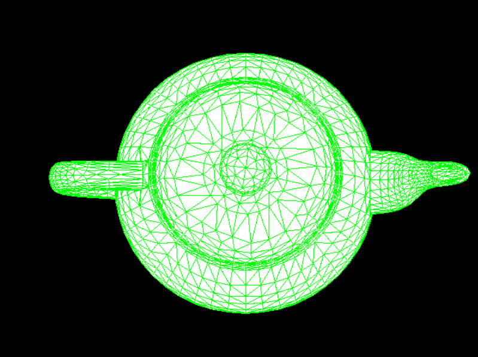

# 实验一：实现三角形的光栅化算法

## 1.1 用 DDA 实现三角形边的绘制

### 算法原理

DDA (Digital Differential Analyzer) 的基本思想是通过增量的方式，从起点逐步生成直线的每一个像素点。在斜率较小（|m| <= 1）时，按照X增量计算Y值；在斜率较大（|m| > 1）时，按照Y增量计算X值。算法流程如下：

1. **输入直线的起点和终点**  
   给定直线的起点 `(x0, y0)` 和终点 `(x1, y1)`。

2. **计算直线的增量**  
   计算直线的增量：
   - `dx = x1 - x0`  
   - `dy = y1 - y0`  

3. **计算步数**  
   步数 `steps` 由最大增量决定：
   - `steps = max(abs(dx), abs(dy))`  
   其中，`abs()` 表示取绝对值。

4. **计算增量**  
   计算每一步的增量：
   - `xIncrement = dx / steps`  
   - `yIncrement = dy / steps`  

5. **初始化起始点**  
   初始化起始点 `(x, y)`：
   - `x = x0`  
   - `y = y0`  

6. **绘制直线**  
   从起始点开始循环，逐步绘制直线的每个点：
   - 对每一步，计算出当前的 `(x, y)`，并将其**四舍五入**到最接近的整数。
   - 更新坐标：
     - `x = x + xIncrement`
     - `y = y + yIncrement`

7. **结束条件**  
   当步数达到 `steps` 时，算法结束。

### 代码实现

```
// ##############################################################
// ## 函数：DDA
// ## 函数描述：使用DDA算法绘制线段
// ## 参数描述：
// ##	FragmentAttr& start：线段起始点
// ##	FragmentAttr& end：线段结束点
// ##	int id：线段id（保留参数，暂未使用）
// ##############################################################
void MyGLWidget::DDA(FragmentAttr& start, FragmentAttr& end, int id) {
	float x0 = start.x, y0 = start.y;
	float x1 = end.x, y1 = end.y;

	float dx = x1 - x0;
	float dy = y1 - y0;

	int steps = abs(dx) > abs(dy) ? abs(dx) : abs(dy);

	float xIncrement = dx / steps;
	float yIncrement = dy / steps;

	vec3 line_color = start.color;

	float z0 = start.z;
	float z1 = end.z;
	float zIncrement = (z1 - z0) / steps;

	float x = x0;
	float y = y0;
	float z = z0;

	for (int i = 0; i <= steps; i++) {
		int xi = round(x);
		int yi = round(y);

		if (xi >= 0 && xi < WindowSizeW && yi >= 0 && yi < WindowSizeH) {
			int buffer_index = yi * WindowSizeW + xi;
			if (temp_z_buffer[buffer_index] > z) {
				temp_z_buffer[buffer_index] = z;
				temp_render_buffer[buffer_index] = line_color;
			}
		}

		x += xIncrement;
		y += yIncrement;
		z += zIncrement;
	}
}
```

### 绘制效率 & 绘制效果

为了方便记录光栅化所需的时间，修改paintGL()函数如下：

```
#include <ctime>
void MyGLWidget::paintGL()
{
	clock_t start_time = clock();
	switch (scene_id) {
	case 0: scene_0(); break;
	case 1: scene_1(); break;
	}
	clock_t end_time = clock();

	double render_time = static_cast<double>(end_time - start_time) / CLOCKS_PER_SEC * 1000;

	std::cout << "Render time: " << render_time << " ms" << std::endl;
}
```

绘制一个三角形，DDA算法所需的时间大致为14ms
```
read 1 triangles
Render time: 14 ms
Render time: 16 ms
Render time: 15 ms
Render time: 16 ms
Render time: 13 ms
Render time: 13 ms
Render time: 13 ms
```


绘制含612个三角形的teapot，DDA算法所需的时间大约为4600ms
```
read 612 triangles
Render time: 4839 ms
Render time: 4715 ms
Render time: 4828 ms
Render time: 4774 ms
Render time: 4525 ms
Render time: 4576 ms
Render time: 4543 ms
Render time: 4551 ms
Render time: 4589 ms
Render time: 4586 ms
Render time: 4546 ms
Render time: 4604 ms
Render time: 4801 ms
Render time: 4802 ms
```


绘制含7657个三角形的teapot，DDA算法所需时间大约为57000ms
```
read 7657 triangles
Render time: 56850 ms
Render time: 56545 ms
Render time: 56623 ms
Render time: 57259 ms
```


## 1.2 用 bresenham 实现三角形边的绘制

### 算法原理

Bresenham 算法是一种用于绘制线段的高效算法，它基于整数运算，避免了浮点数的计算，从而提升了绘制过程中的计算效率。其核心思想是，通过计算一个误差值来决定下一个像素点的位置。这个误差值衡量的是当前线段的真实位置与理想位置之间的偏差，算法通过在误差值大于某个阈值时调整绘制路径，从而保证绘制出的线段尽可能接近理想直线。算法流程如下：

1. **初始化起点和终点**
给定一条直线的起点 (x0, y0) 和终点 (x1, y1)，我们需要在这两个点之间绘制直线。首先，我们计算两点之间的差值：
dx = |x1 - x0| // x轴上的步长
dy = |y1 - y0| // y轴上的步长
2. **计算步进方向**
为了绘制直线，我们需要决定在每一步中是沿着 x 轴还是 y 轴移动。为了确保绘制的方向一致，我们根据终点相对于起点的坐标差异来选择步进方向：
sx = 1 if x1 > x0 else sx = -1 // x轴方向的步进方向
sy = 1 if y1 > y0 else sy = -1 // y轴方向的步进方向
3. **计算误差值**
Bresenham 算法通过计算一个误差值来判断如何绘制下一个像素点。误差值表示了当前像素点与理想直线之间的偏差。初始化误差值如下：
err = dx - dy
这个误差值的作用是：通过比较当前误差值的大小，决定是调整 x 坐标还是 y 坐标，或者同时调整两者。
4. **迭代绘制**
在每一步迭代中，算法根据当前的误差值判断是否应该沿着 x 轴或 y 轴绘制下一个像素。迭代过程直到达到终点 (x1, y1) 为止。
- 判断水平步进：如果误差值的两倍大于 -dy，说明应该沿着 x 轴步进：
```
if (2 * err > -dy):
    err -= dy
    x0 += sx
```
- 判断垂直步进：如果误差值的两倍小于 dx，说明应该沿着 y 轴步进：
```
if (2 * err < dx):
    err += dx
    y0 += sy
```

### 代码实现
加分项：补充了像素在画布外的处理方式
```
void MyGLWidget::bresenham(FragmentAttr& start, FragmentAttr& end, int id) {
	// 根据起点、终点，计算当前边在画布上的像素
	//（可以只考虑都在画布中。加分思考：在画布外怎么处理）
	//vec3 line_color = start.color;
	int x0 = start.x, y0 = start.y, x1 = end.x, y1 = end.y;
	int dx = abs(x1 - x0), sx = x0 < x1 ? 1 : -1;
	int dy = abs(y1 - y0), sy = y0 < y1 ? 1 : -1;
	int p0 = (dx > dy ? dx : -dy) / 2;

	int z0 = start.z, z1 = end.z;
	float dzdx = static_cast<float>(z1 - z0) / dx;
	float dzdy = static_cast<float>(z1 - z0) / dy; 
	float z = static_cast<float>(z0);

	while (x0 != x1 || y0 != y1) {
		if (x0 < 0 || x0 >= WindowSizeW || y0 < 0 || y0 >= WindowSizeH) {
			return;  // 在画布外的处理方式：直接忽略
		}

		temp_render_buffer[y0 * WindowSizeW + x0] = vec3(0.0, 1.0, 0.0); // 画绿色
		temp_z_buffer[y0 * WindowSizeW + x0] = z;

		int pk = p0;
		if (pk > -dx) { p0 -= dy; x0 += sx; }
		if (pk < dy) { p0 += dx; y0 += sy; }

		if (dx > dy) z += dzdx;  
		else z += dzdy;  
	}
}
```

### 绘制效率 & 绘制效果

绘制一个三角形，bresenham算法所需的时间大致为13ms
```
read 1 triangles
Render time: 13 ms
Render time: 13 ms
Render time: 13 ms
Render time: 13 ms
Render time: 14 ms
Render time: 14 ms
Render time: 13 ms
Render time: 14 ms
Render time: 13 ms
```


绘制含612个三角形的teapot，bresenham算法所需的时间大约为4700ms
```
read 612 triangles
Render time: 4699 ms
Render time: 4735 ms
Render time: 4693 ms
Render time: 4693 ms
Render time: 4754 ms
Render time: 4739 ms
Render time: 4688 ms
Render time: 4713 ms
Render time: 4722 ms
Render time: 4757 ms
```


绘制含7657个三角形的teapot，bresenham算法所需时间大约为58000ms
```
read 7657 triangles
Render time: 59957 ms
Render time: 59318 ms
Render time: 57667 ms
Render time: 58004 ms
```


## 1.3 用 edge-walking 填充三角形内部颜色

### 算法原理
edge_walking 算法用于在光栅化过程中填充三角形的内部区域。该算法通过遍历每一行的边缘像素，并根据这些边缘像素之间的关系填充内部像素。算法流程如下：

1. **边缘像素提取**
首先，算法遍历整个窗口的每个像素，识别并存储属于三角形边缘的像素。在这里的实现中，边缘像素在缓冲区中具有非黑色（非背景）值，因此通过检查像素是否为非黑色来确定其是否为边缘像素。

2. **对每一行的边缘像素进行排序**
为了正确地识别每一行的填充区间，算法对每行的边缘像素的 x 坐标进行排序。这样可以确保从左到右的顺序进行填充。

3. **填充三角形内部区域**
对于每一行中的每对边缘像素，算法计算并填充它们之间的区域。在填充时，跳过边缘像素本身，确保只填充位于两边缘像素之间的区域。

4. **深度和颜色插值**
在填充过程中，算法通过线性插值计算每个像素的深度值（z值），颜色目前暂时被设置为固定的白色。结果存储在 temp_render_buffer 和 temp_z_buffer 中。


### 代码实现

```
int MyGLWidget::edge_walking() {
	// 存储每一行的边缘像素
	std::vector<std::vector<int>> edge_table(WindowSizeH);

	for (int y = 0; y < WindowSizeH; ++y) {
		for (int x = 0; x < WindowSizeW; ++x) {
			int index = y * WindowSizeW + x;
			if (temp_render_buffer[index] != vec3(0.0, 0.0, 0.0)) {
				edge_table[y].push_back(x); 
			}
		}
	}

	// 填充三角形内部区域
	for (int y = 0; y < WindowSizeH; ++y) {
		if (edge_table[y].size() >= 2) {
			std::sort(edge_table[y].begin(), edge_table[y].end());
			for (size_t i = 0; i < edge_table[y].size(); i += 1) {
				if (i + 1 < edge_table[y].size()) {
					int x_start = edge_table[y][i];
					int x_end = edge_table[y][i + 1];

					// 避免填充到边缘像素
					if (x_start == x_end) continue;

					// 填充中间像素
					float z_start = temp_z_buffer[y * WindowSizeW + x_start];
					float z_end = temp_z_buffer[y * WindowSizeW + x_end];

					//vec3 color_start = temp_render_buffer[y * WindowSizeW + x_start];
					//vec3 color_end = temp_render_buffer[y * WindowSizeW + x_end];

					for (int x = x_start + 1; x < x_end; ++x) { 
						int index = y * WindowSizeW + x;

						// 插值计算深度值
						float t = static_cast<float>(x - x_start) / (x_end - x_start);
						float interpolated_z = (1 - t) * z_start + t * z_end;

						// 插值计算颜色值
						//vec3 interpolated_color = (1 - t) * color_start + t * color_end;
						vec3 interpolated_color = vec3(1.0, 1.0, 1.0); // 暂时直接填充白色

						// 写入缓冲区
						temp_z_buffer[index] = interpolated_z;
						temp_render_buffer[index] = interpolated_color;
					}
				}
			}
		}
	}
	return 0;
}
```
### 绘制效果

一个三角形 (using DDA)


含612个三角形的teapot (using DDA)


含7657个三角形的teapot（using DDA）


## 1.4 讨论

分析上述实际运行时间，发现DDA与Bresenham在绘制不同面数的模型时所耗费的时间差不多。更准确地讲，DDA的绘制效率会稍微高一点。虽然说 Bresenham 采用的是整数运算，避免了浮点运算，但是其分支逻辑较多，特别是判断条件较多（如两个 if 条件），可能会导致在硬件流水线中效率不如简单的连续运算。同时，现代硬件中，浮点运算单元的优化使浮点加法和整数加法的性能差距缩小，甚至浮点加法的吞吐量更高，尤其在流水线深度较高的情况下。因此，DDA的绘制效率更高是合理的。

# 实验二：实现光照、着色

下列的三种方法都是对三角形内部进行着色，对于三角形的顶点的着色，我们在此统一采用Phong Reflectance Model，然后再通过以下不同的插值方法计算三角形内部像素的值。

在实现GOURAUD, PHONG, BLINN_PHONG前，我们需要修改原来的代码逻辑。由于edge_walking()方法负责对三角形内部进行着色，我们补充修改其实现如下，在计算颜色值时动态调用这三种模型。

```
int MyGLWidget::edge_walking(FragmentAttr* transformedVertices) {
	// 存储每一行的边缘像素
	std::vector<std::vector<int>> edge_table(WindowSizeH);
	bool firstFilledLineFound = false;  
	int firstFilledLine = -1;  // 记录第一个填充的行

	for (int y = 0; y < WindowSizeH; ++y) {
		for (int x = 0; x < WindowSizeW; ++x) {
			int index = y * WindowSizeW + x;
			if (temp_render_buffer[index] != vec3(0.0, 0.0, 0.0)) {
				edge_table[y].push_back(x); 
			}
		}
		if (!firstFilledLineFound && edge_table[y].size() > 1) {
			firstFilledLine = y;
			firstFilledLineFound = true;
		}
	}

	// 填充三角形内部区域
	for (int y = 0; y < WindowSizeH; ++y) {
		if (edge_table[y].size() >= 2) {
			std::sort(edge_table[y].begin(), edge_table[y].end());
			for (size_t i = 0; i < edge_table[y].size(); i += 1) {
				if (i + 1 < edge_table[y].size()) {
					int x_start = edge_table[y][i];
					int x_end = edge_table[y][i + 1];

					float z_start = temp_z_buffer[y * WindowSizeW + x_start];
					float z_end = temp_z_buffer[y * WindowSizeW + x_end];

					for (int x = x_start + 1; x < x_end; ++x) { 
						int index = y * WindowSizeW + x;

						// 插值计算深度值
						float t = static_cast<float>(x - x_start) / (x_end - x_start);
						float interpolated_z = (1 - t) * z_start + t * z_end;

						// 插值计算颜色值
						switch (shadingMode) {
							case GOURAUD:
								GouraudShading(x, y, transformedVertices, index);
								break;
							case PHONG:
								PhongShading(x, y, transformedVertices, index);
								break;
							case BLINN_PHONG:
								BlinnPhongShading(x, y, transformedVertices, index);
								break;
						}
						//vec3 interpolated_color = vec3(1.0, 1.0, 1.0); // 暂时直接填充白色

						// 写入缓冲区
						temp_z_buffer[index] = interpolated_z;
					}
				}
			}
		}
	}
	return firstFilledLine != -1 ? firstFilledLine : 0;
}
```

## 2.1 用 Gouraud 实现三角形内部的着色

### 算法原理

Gouraud 算法是基于插值的方法，在三角形的顶点处计算颜色，然后通过插值技术将这些颜色扩展到三角形的其他部分，从而实现平滑的过渡效果。其主要优点是计算效率高，但缺点是对于某些光照效果（如高光）表现不够理想。算法流程如下：

- **顶点光照计算**：首先在多边形的每个顶点上计算光照模型（如 Lambertian 光照或 Phong 光照模型），得到每个顶点的颜色。

- **颜色插值**：接着，在多边形的内部（即三角形内的其他像素）进行颜色插值，利用顶点的颜色进行平滑过渡。具体来说，使用线性插值的方法，推算每个像素的颜色。对于一个三角形，其三个顶点的颜色分别为 $C_1 C_2 C_3$，在该三角形内部某个像素的颜色 $C$ 可以通过以下公式计算 
$$
C=\lambda_{1} C_{1}+\lambda_{2} C_{2}+\lambda_{3} C_{3}
$$
$\lambda_{1} \lambda_{2} \lambda_{3}$​为该像素到三角形三个顶点的相对权重，基于像素与顶点之间的相对距离进行计算。

### 代码实现
根据GAMES101课程作业中给出的处理方式，我们统一通过计算**重心坐标**的方式来得到特定像素到其三角形三个顶点的相对权重。
```
void MyGLWidget::GouraudShading(int x, int y, FragmentAttr* v, int index) {
	// 重心坐标
	float alpha = (((float)(y - v[1].y) * (v[2].x - v[1].x) - (float)(x - v[1].x) * (v[2].y - v[1].y)) /
				  ((float)(v[0].y - v[1].y) * (v[2].x - v[1].x) - (float)(v[0].x - v[1].x) * (v[2].y - v[1].y)));
	float beta  = ((float)(y - v[2].y) * (v[0].x - v[2].x) - (float)(x - v[2].x) * (v[0].y - v[2].y)) /
				  ((float)(v[1].y - v[2].y) * (v[0].x - v[2].x) - (float)(v[1].x - v[2].x) * (v[0].y - v[2].y));
	float gamma = 1 - alpha - beta;

	vec3 color = alpha * v[0].color + beta * v[1].color + gamma * v[2].color;
	temp_render_buffer[index] = color;
}
```

### 绘制效果 & 渲染效率

Render time: 70904 ms


## 2.2 用 Phong 模型实现三角形内部的着色

### 算法原理
对法向量插值，再根据插值法向量计算每个像素的光照。算法流程如下：

- 在三角形的每个顶点处提供法向量
- 对三角形内部的法向量进行插值处理
- 在每个像素处，使用插值后的法向量重新计算光照方程，得到像素的最终颜色

### 代码实现

```
vec3 MyGLWidget::PhongShading(FragmentAttr& nowPixelResult) {

	vec3 norm = glm::normalize(nowPixelResult.normal);
	vec3 lightDir = glm::normalize(lightPosition - nowPixelResult.pos_mv);
	vec3 viewDir = glm::normalize(camPosition - nowPixelResult.pos_mv);
	vec3 reflectDir = glm::reflect(-lightDir, norm);

	vec3 ambient = ambientStrength * lightColor;

	float diff = glm::max(glm::dot(norm, lightDir), 0.0f);
	vec3 diffuse = diff * lightColor;

	float spec = glm::pow(glm::max(glm::dot(viewDir, reflectDir), 0.0f), 16);
	vec3 specular = specularStrength * spec * lightColor;

	vec3 color = (ambient + diffuse + specular) * objectColor;
	return color;
}

void MyGLWidget::PhongShading(int x, int y, FragmentAttr* v, int index) {
	// 重心坐标
	float alpha = (((float)(y - v[1].y) * (v[2].x - v[1].x) - (float)(x - v[1].x) * (v[2].y - v[1].y)) /
		((float)(v[0].y - v[1].y) * (v[2].x - v[1].x) - (float)(v[0].x - v[1].x) * (v[2].y - v[1].y)));
	float beta = ((float)(y - v[2].y) * (v[0].x - v[2].x) - (float)(x - v[2].x) * (v[0].y - v[2].y)) /
		((float)(v[1].y - v[2].y) * (v[0].x - v[2].x) - (float)(v[1].x - v[2].x) * (v[0].y - v[2].y));
	float gamma = 1 - alpha - beta;

	vec3 interpolatedNormal = alpha * v[0].normal + beta * v[1].normal + gamma * v[2].normal;
	vec3 interpolatedPosMV = alpha * vec3(v[0].pos_mv) +
							 beta  * vec3(v[1].pos_mv) +
							 gamma * vec3(v[2].pos_mv);

	FragmentAttr nowPixelResult(x, y, 0.0f, 0);
	nowPixelResult.normal = glm::normalize(interpolatedNormal);
	nowPixelResult.pos_mv = interpolatedPosMV;

	vec3 finalColor = PhongShading(nowPixelResult); 
	temp_render_buffer[index] = finalColor;
}
```

### 绘制效果 & 渲染效率
Render time: 71152 ms


## 2.3 用 Blinn-Phong 实现三角形内部的着色

### 算法原理
与 Phong 着色类似，但改进了光照计算中的高光部分。算法流程如下：

- 在三角形的每个顶点处计算法向量和光照信息
- 在每个像素处，插值法向量并计算半程向量（光源方向与观察方向的中点向量）
- 使用插值后的法向量和半程向量计算高光分量以及最终像素颜色

### 代码实现

```
vec3 MyGLWidget::BlinnPhong(FragmentAttr& nowPixelResult) {

	vec3 norm = glm::normalize(nowPixelResult.normal);
	vec3 lightDir = glm::normalize(lightPosition - nowPixelResult.pos_mv);
	vec3 viewDir = glm::normalize(camPosition - nowPixelResult.pos_mv);

	vec3 halfDir = glm::normalize(lightDir + viewDir);

	vec3 ambient = ambientStrength * lightColor;

	float diff = glm::max(glm::dot(norm, lightDir), 0.0f);
	vec3 diffuse = diff * lightColor;

	float spec = glm::pow(glm::max(glm::dot(norm, halfDir), 0.0f), 16);
	vec3 specular = specularStrength * spec * lightColor;

	vec3 color = (ambient + diffuse + specular) * objectColor;
	return color;
}

void MyGLWidget::BlinnPhongShading(int x, int y, FragmentAttr* v, int index) {
	// 重心坐标
	float alpha = (((float)(y - v[1].y) * (v[2].x - v[1].x) - (float)(x - v[1].x) * (v[2].y - v[1].y)) /
		((float)(v[0].y - v[1].y) * (v[2].x - v[1].x) - (float)(v[0].x - v[1].x) * (v[2].y - v[1].y)));
	float beta = ((float)(y - v[2].y) * (v[0].x - v[2].x) - (float)(x - v[2].x) * (v[0].y - v[2].y)) /
		((float)(v[1].y - v[2].y) * (v[0].x - v[2].x) - (float)(v[1].x - v[2].x) * (v[0].y - v[2].y));
	float gamma = 1 - alpha - beta;

	vec3 interpolatedNormal = alpha * v[0].normal + beta * v[1].normal + gamma * v[2].normal;
	vec3 interpolatedPosMV = alpha * vec3(v[0].pos_mv) +
							 beta  * vec3(v[1].pos_mv) +
							 gamma * vec3(v[2].pos_mv);

	FragmentAttr nowPixelResult(x, y, 0.0f, 0);  
	nowPixelResult.normal = glm::normalize(interpolatedNormal);
	nowPixelResult.pos_mv = interpolatedPosMV;

	vec3 finalColor = BlinnPhong(nowPixelResult); 
	temp_render_buffer[index] = finalColor;
}

```

### 绘制效果 & 渲染效率
Render time: 71684 ms


## 2.4 讨论

在 Intel i7-9750H 处理器默认单核上运行本项目，Line Drawing Algorithm均选择DDA，仅渲染1帧时三种着色模型的开销如下

<div align="center">

| Method       | time / ms      | 
| ------------ | -------------- |
| Gouraud      | 70904          |
| Phong        | 71152          |
| Blinn-Phong  | 71684          |
</div>

发现三种模型渲染效率相近，Gouraud由于是直接对像素值进行插值，所以计算开销最小，而Phong和Blinn-Phong都需要对每个像素计算插值后的法线并应用光照模型，计算开销会稍大。

# 3. 遇到的问题

## 3.1 物体不在中心点
前面在渲染的时候发现物体老是有一小部分渲染到画布外面去，如下图所示：


仔细观察发现物体根本就不在画布中央，但看原本代码框架的意思是物体应该在画面的中央：
```
void MyGLWidget::scene_1()
{
	......
	camLookAt = objModel.centralPoint;     // 看向物体中心
}
```
接着就发现这个地方x和y的位置写反了


同时resizeGL中计算offset时也弄反了W和H的位置


将顺序调换过来，问题即可解决
```
void MyGLWidget::scene_1()
{
	......
	camPosition = vec3(100 * sin(degree * 3.14 / 180.0) + objModel.centralPoint.x,
		100 * cos(degree * 3.14 / 180.0) + objModel.centralPoint.y,
		10 + objModel.centralPoint.z);
}
```
```
void MyGLWidget::resizeGL(int w, int h)
{
	resizeBuffer(w, h);
	offset = vec2(WindowSizeW / 2, WindowSizeH / 2);
	clearBuffer(render_buffer);
}
```


## 3.2 物体渲染不全

按照原有的配置，就算茶壶调整回画面中心，也有可能渲染不全


我们只需要让视角更宽一点就好了。在scene_1中有这么一行代码：
```
void MyGLWidget::scene_1()
{
	......
	projMatrix = glm::perspective(radians(20.0f), 1.0f, 0.1f, 2000.0f);

}
```
把glm::perspective第一个参数(fovy)稍微改大一点即可：
```
void MyGLWidget::scene_1()
{
	......
	projMatrix = glm::perspective(radians(25.0f), 1.0f, 0.1f, 2000.0f);

}
```
问题解决
