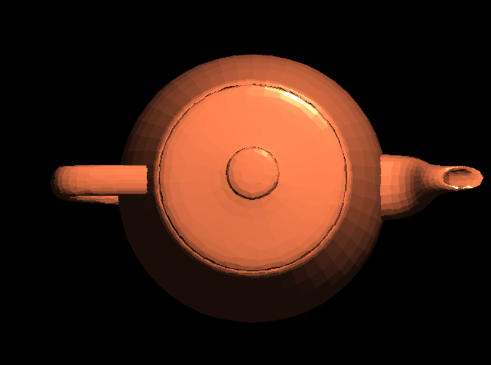
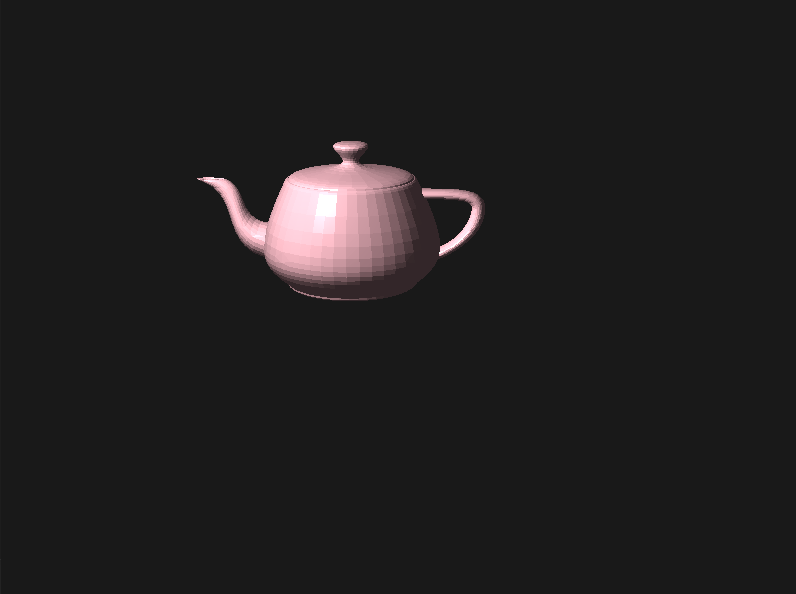

# 实验：Phong shading 与 VBO 绘制三维物体

## 实验原理

### 1. Phong shading
Phong shading在hw2中已经实现过，其简要流程如下：

- 在三角形的每个顶点处提供法向量
- 对三角形内部的法向量进行插值处理
- 在每个像素处，使用插值后的法向量重新计算光照方程，得到像素的最终颜色

在编写OpenGL代码时，我们只需要将每个顶点的法向量传入顶点着色器，顶点着色器会自动将法向量插值并传入片元着色器，无需像hw2中那样手动插值。本实验我们只需关注片元着色器中环境光、漫反射和镜面反射的计算。

### 2. Smooth shading

在 OpenGL 中，Smooth Shading是一种通过插值计算顶点颜色或法线来生成平滑表面的技术。与 Flat Shading不同，Smooth Shading 会在每个像素上插值计算颜色或法线，从而在表面上生成平滑的光照效果。


### 3. VBO

VBO 是用于存储顶点数据的缓冲区对象。它可以存储顶点的位置、颜色、法线、纹理坐标等属性。使用VBO可以将顶点数据从CPU传输到GPU，从而减少每次绘制时数据传输的开销，提高渲染性能。

在本实验中，我们使用VAO搭配VBO

VAO 是一个对象，它封装了VBO的配置状态。VAO存储了顶点属性的指针、VBO的绑定状态以及EBO的绑定状态。使用VAO可以简化顶点属性的配置过程，特别是在绘制多个对象时，只需绑定不同的VAO即可切换不同的顶点配置。


## 代码实现

虽然本次实验是在hw2的基础上实现，但是渲染的流程完全不相同，因此我对原有的框架做了大幅的删减，仅保留了utils.h中的Model用于加载obj模型，以及MyGLWidget类中必要的成员如initializeGL()和paintGL()：
```cpp
class MyGLWidget : public QOpenGLWidget, public QOpenGLExtraFunctions{
    Q_OBJECT

public:
    MyGLWidget(QWidget *parent = nullptr);
    ~MyGLWidget();

protected:
    void initializeGL() override;
    void paintGL() override;
    void keyPressEvent(QKeyEvent* e);

private:
    void scene_0();

    GLuint VAO, VBO, EBO;
    GLuint shaderProgram;

    int WindowSizeH = 0;
    int WindowSizeW = 0;
    float degree = 0;

    Model objModel;

    vec3 camPosition;
    vec3 camLookAt;
    vec3 camUp;
    mat4 projMatrix;
    vec3 lightPosition;
    vec3 lightColor = vec3(1.0f, 1.0f, 1.0f);  // °×¹â
    vec3 objectColor = vec3(1.0f, 0.753f, 0.796f); // ³ÈÉ«

};
```

现在我们的代码逻辑非常清晰：main.cpp中w.show()首先调用initializeGL()，接着循环调用paintGL()来绘制物体。

首先，我们要实现顶点着色器和片元着色器：
vertex shader：
```
#version 330 core

layout(location = 0) in vec3 aPos; // 顶点位置
layout(location = 1) in vec3 aNormal; // 法向量

out vec3 FragPos;  // 片段位置
out vec3 Normal;   // 法线

uniform mat4 model;
uniform mat4 view;
uniform mat4 projection;

void main()
{
    FragPos = vec3(model * vec4(aPos, 1.0)); 
    Normal = mat3(transpose(inverse(model))) * aNormal;  
    gl_Position = projection * view * vec4(FragPos, 1.0);  
}
```

fragment shader:
```
#version 330 core

in vec3 FragPos;      // 从顶点着色器传递的片段位置
in vec3 Normal;       // 从顶点着色器传递的法线
out vec4 FragColor;   // 输出颜色

uniform vec3 lightPos;    // 光源位置
uniform vec3 viewPos;     // 观察者位置
uniform vec3 lightColor;  // 光源颜色
uniform vec3 objectColor; // 物体颜色

void main()
{
    // 环境光
    float ambientStrength = 0.2;
    vec3 ambient = ambientStrength * lightColor;

    // 漫反射
    vec3 norm = normalize(Normal);
    vec3 lightDir = normalize(lightPos - FragPos);
    float diff = max(dot(norm, lightDir), 0.0);
    vec3 diffuse = diff * lightColor;

    // 镜面反射
    float specularStrength = 0.5;
    vec3 viewDir = normalize(viewPos - FragPos);
    vec3 reflectDir = reflect(-lightDir, norm);
    float spec = pow(max(dot(viewDir, reflectDir), 0.0), 32);
    vec3 specular = specularStrength * spec * lightColor;

    // 最终颜色
    vec3 result = (ambient + diffuse + specular) * objectColor;
    FragColor = vec4(result, 1.0);
}
```

接着，在初始化阶段，我们需要先编译和链接着色器程序：
```cpp
GLuint vertexShader = glCreateShader(GL_VERTEX_SHADER);
glShaderSource(vertexShader, 1, &vertexShaderSource, nullptr);
glCompileShader(vertexShader);

GLuint fragmentShader = glCreateShader(GL_FRAGMENT_SHADER);
glShaderSource(fragmentShader, 1, &fragmentShaderSource, nullptr);
glCompileShader(fragmentShader);

shaderProgram = glCreateProgram();
glAttachShader(shaderProgram, vertexShader);
glAttachShader(shaderProgram, fragmentShader);
glLinkProgram(shaderProgram);

glDeleteShader(vertexShader);
glDeleteShader(fragmentShader);
```

然后将模型加载进来：
```cpp
// 加载模型
scene_0();

// 创建顶点数据列表
std::vector<float> vertexData;
for (int i = 0; i < objModel.triangleCount; ++i) {
    for (int j = 0; j < 3; ++j) {
        int vertexIndex = objModel.triangles[i][j] ; 
        int normalIndex = objModel.triangle_normals[i][j] ;
        vertexData.push_back(objModel.vertices_data[vertexIndex].x);
        vertexData.push_back(objModel.vertices_data[vertexIndex].y);
        vertexData.push_back(objModel.vertices_data[vertexIndex].z);
        vertexData.push_back(objModel.normals_data[normalIndex].x);
        vertexData.push_back(objModel.normals_data[normalIndex].y);
        vertexData.push_back(objModel.normals_data[normalIndex].z);
    }
}
```

接着创建VAO和VBO并设置：
```cpp
// 创建 VAO 和 VBO
glGenVertexArrays(1, &VAO);
glGenBuffers(1, &VBO);

glBindVertexArray(VAO);

// 将顶点数据传输到缓冲区
glBindBuffer(GL_ARRAY_BUFFER, VBO);
glBufferData(GL_ARRAY_BUFFER, vertexData.size() * sizeof(float), vertexData.data(), GL_STATIC_DRAW);

// 设置顶点属性指针
glVertexAttribPointer(0, 3, GL_FLOAT, GL_FALSE, 6 * sizeof(float), (void*)0);
glEnableVertexAttribArray(0);
glVertexAttribPointer(1, 3, GL_FLOAT, GL_FALSE, 6 * sizeof(float), (void*)(3 * sizeof(float)));
glEnableVertexAttribArray(1);

glBindVertexArray(0);
```

进入绘制阶段，我们将myglwidget.h中定义的相关变量传入着色器程序中即可，随后调用glDrawArrays绘制
```cpp
void MyGLWidget::paintGL() {
    clock_t start_time = clock();

    // 清除颜色缓冲区和深度缓冲区
    glClear(GL_COLOR_BUFFER_BIT | GL_DEPTH_BUFFER_BIT);

    // 使用着色器程序
    glUseProgram(shaderProgram);

    // 设置 uniform 变量
    GLuint modelLoc = glGetUniformLocation(shaderProgram, "model");
    GLuint viewLoc = glGetUniformLocation(shaderProgram, "view");
    GLuint projLoc = glGetUniformLocation(shaderProgram, "projection");
    GLuint lightPosLoc = glGetUniformLocation(shaderProgram, "lightPos");
    GLuint viewPosLoc = glGetUniformLocation(shaderProgram, "viewPos");
    GLuint lightColorLoc = glGetUniformLocation(shaderProgram, "lightColor");
    GLuint objectColorLoc = glGetUniformLocation(shaderProgram, "objectColor");

    mat4 model = mat4(1.0f);
    model = glm::rotate(model, (float)degree, vec3(0.0f, 1.0f, 0.0f)); // 旋转模型
    model = glm::scale(model, vec3(100.0f)); // yomiya : 100.0f
    mat4 view = glm::lookAt(camPosition, camLookAt, camUp);
    glUniformMatrix4fv(modelLoc, 1, GL_FALSE, glm::value_ptr(model));
    glUniformMatrix4fv(viewLoc, 1, GL_FALSE, glm::value_ptr(view));
    glUniformMatrix4fv(projLoc, 1, GL_FALSE, glm::value_ptr(projMatrix));

    glUniform3fv(lightPosLoc, 1, glm::value_ptr(lightPosition));
    glUniform3fv(viewPosLoc, 1, glm::value_ptr(camPosition));
    glUniform3fv(lightColorLoc, 1, glm::value_ptr(lightColor));
    glUniform3fv(objectColorLoc, 1, glm::value_ptr(objectColor));

    // 绘制物体
    glBindVertexArray(VAO);
    glDrawArrays(GL_TRIANGLES, 0, objModel.triangleCount * 3);
    glBindVertexArray(0);

    clock_t end_time = clock();
    double render_time = static_cast<double>(end_time - start_time) / CLOCKS_PER_SEC * 1000;
    std::cout << "Render time: " << render_time << " ms" << std::endl;
}
```

## 实验结果 & 讨论

### 1. 对比Phongshading与OpenGL自带的smoothingshading的区别

对于这个问题，首先，OpenGL 默认使用的是 Smooth Shading，这意味着如果在顶点着色器中传递了法线或颜色，OpenGL 会自动在片段着色器中对这些值进行插值，从而生成平滑的效果。其次，Phong Shading 本身就是一种 Smooth Shading，因为它会在每个像素上插值计算法线，从而生成平滑的光照效果。所以我认为Phongshading与smoothingshading没有可比性。

### 2. 讨论VBO中是否使用indexarray的效率区别。

使用 Index Array 时，顶点数据只存储一次，而索引数组存储了每个三角形的顶点索引。通过顶点数据复用减少了内存占用，提高了绘制效率。

原有的代码未使用 Index Array，可以通过如下过程扩展出使用 Index Array的版本：

首先声明索引数组与EBO
```
GLuint VAO, VBO, EBO;
std::vector<unsigned int> indices; // index array
```

然后在创建顶点数据列表时填充索引数组
```
// 创建顶点数据列表
std::vector<float> vertexData;
for (int i = 0; i < objModel.triangleCount; ++i) {
    for (int j = 0; j < 3; ++j) {
        int vertexIndex = objModel.triangles[i][j] ; 
        int normalIndex = objModel.triangle_normals[i][j] ;
        vertexData.push_back(objModel.vertices_data[vertexIndex].x);
        vertexData.push_back(objModel.vertices_data[vertexIndex].y);
        vertexData.push_back(objModel.vertices_data[vertexIndex].z);
        vertexData.push_back(objModel.normals_data[normalIndex].x);
        vertexData.push_back(objModel.normals_data[normalIndex].y);
        vertexData.push_back(objModel.normals_data[normalIndex].z);
    }
    indices.push_back(i * 3);
    indices.push_back(i * 3 + 1);
    indices.push_back(i * 3 + 2);
}
```

处理EBO
```
glGenBuffers(1, &EBO);
// 将索引数据传输到缓冲区
glBindBuffer(GL_ELEMENT_ARRAY_BUFFER, EBO);
glBufferData(GL_ELEMENT_ARRAY_BUFFER, indices.size() * sizeof(unsigned int), indices.data(), GL_STATIC_DRAW);
```

最后在paintGL()中绘制时，将glDrawArray替换为glDrawElements
```
//glDrawArrays(GL_TRIANGLES, 0, objModel.triangleCount * 3);
glDrawElements(GL_TRIANGLES, objModel.triangleCount * 3, GL_UNSIGNED_INT, 0);
```

绘制出来的结果与不使用 Index Array 的相同


对于上面这个两万多个面的模型，不管是使用Index Array还是不使用，每次绘制的时间仍然不到1ms，二者的效率在这里简单场景的绘制在效率上看不出明显的区别。

```
read 25825 triangles
Render time: 0 ms
Render time: 0 ms
Render time: 0 ms
Render time: 0 ms
Render time: 1 ms
Render time: 0 ms
```

### 3/4. 使用VBO进行绘制及通过glVertex进行绘制的区别 / 对比、讨论HW3和HW2的渲染结果、效率的差别

在hw2中提供的框架中，renderWithTexture函数采用glVertex来进行绘制：
```
void renderWithTexture(vec3* render_buffer,int h, int w) {
	glMatrixMode(GL_PROJECTION);
	glPushMatrix();
	glLoadIdentity();
	glMatrixMode(GL_MODELVIEW);
	glPushMatrix();
	glLoadIdentity();
	glEnable(GL_TEXTURE_2D);	
	GLuint texID;
    glGenTextures(1, &texID);
    glBindTexture(GL_TEXTURE_2D, texID);
    glTexParameteri(GL_TEXTURE_2D, GL_TEXTURE_MIN_FILTER, GL_LINEAR);
    glTexParameteri(GL_TEXTURE_2D, GL_TEXTURE_MAG_FILTER, GL_LINEAR);
    glTexImage2D(GL_TEXTURE_2D, 0, GL_RGB, w, h, 0, GL_RGB, GL_FLOAT, render_buffer);
    glEnable(GL_TEXTURE_2D);
    glBindTexture(GL_TEXTURE_2D, texID);
	glBegin(GL_QUADS);
	glTexCoord2f(0.0f, 0.0f);
	glVertex2f(-1.0f, -1.0f);
	glTexCoord2f(0.0f, 1.0f);
	glVertex2f(-1.0f, 1.0f);
	glTexCoord2f(1.0f, 1.0f);
	glVertex2f(1.0f, 1.0f);
	glTexCoord2f(1.0f, 0.0f);
	glVertex2f(1.0f, -1.0f);
	glEnd();
	glDisable(GL_TEXTURE_2D);
	glPopMatrix();
	glMatrixMode(GL_PROJECTION);
	glPopMatrix();
	glPopAttrib();
}
```

使用glVertex的缺点非常明显。首先是性能低下：每次调用 glVertex 都会将数据从 CPU 发送到 GPU，导致大量的数据传输开销。其次是灵活性差：无法利用现代 GPU 的并行计算能力。最重要的是，从 OpenGL 3.0 开始，立即模式（通过 glBegin 和 glEnd 之间的 glVertex、glColor 等函数直接指定顶点数据）被标记为弃用。

相比之下，VBO 是现代 OpenGL 中推荐的绘制方式。它将顶点数据存储在 GPU 的缓冲区中，减少了 CPU 和 GPU 之间的数据传输。

题目中细分物体产生足够多三角面片的目的在于构建一个足够复杂的物体来测试性能，我们这里直接采用原本给定的8000面茶壶以及20000+面的人物模型。在测试中发现，使用原有的obj加载代码，超过几万个面的模型加载会导致程序意外的退出，推测是使用的固定长度的数组会爆内存，所以这里最多就用20000+面的模型作为细分小球的替代。

对于8000面茶壶，hw2中使用glVertex绘制的结果如下

Render time: 71152 ms


而使用VBO绘制的结果如下（换了个颜色）
Render time: 1 ms


二者都是使用的Phong shading，绘制的视觉效果是一样的，但是可以明显地看到使用VBO绘制的效率有巨大的提升，直接实现了模型的实时渲染。

接着绘制一个自己添加的模型，在20000+面的情况下，使用VBO仍然不到1ms即可渲染完毕。
```
read 25825 triangles
Render time: 0 ms
Render time: 1 ms
Render time: 0 ms
Render time: 0 ms
```


